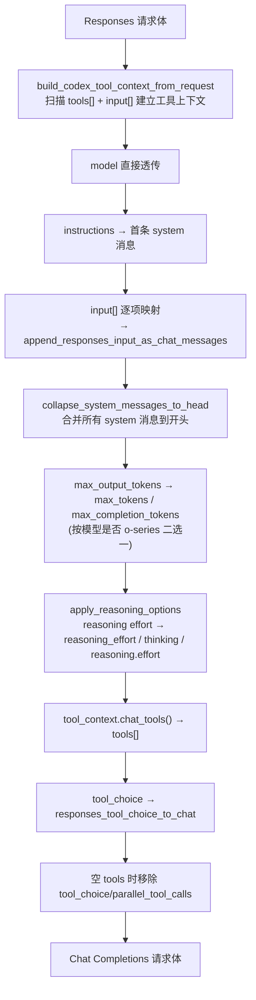
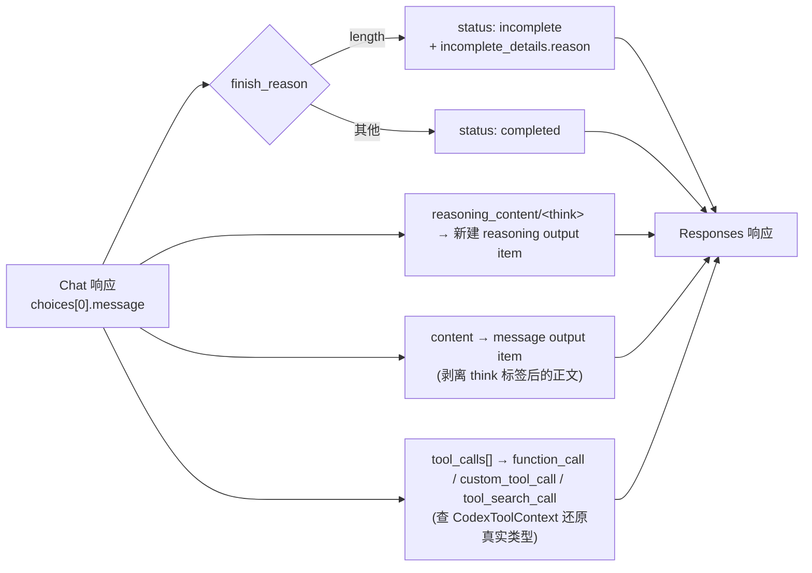

# OpenAI Chat Completions ↔ OpenAI Responses 协议转换详解

> 对应源码：`src-tauri/src/proxy/providers/transform_codex_chat.rs`（3529 行）+ `codex_chat_common.rs`（240 行）
> 场景：Codex CLI 客户端发出 Responses 格式请求，上游供应商只支持 Chat Completions 格式（如 DeepSeek、MiniMax、Moonshot/Kimi、OpenRouter 等）

## 总览：为什么需要这层转换

Codex CLI 只会说 OpenAI Responses 协议：请求体是扁平的 `input` 数组，工具调用、工具结果、reasoning 都是数组里的独立 item。但市面上能接的模型供应商，绝大多数只实现了更早、更通用的 Chat Completions 协议：请求体是 `messages` 数组，工具调用嵌套在 `assistant.tool_calls` 里，没有"input item"这个概念。

这两个协议的核心差异可以归纳为三条：

1. **结构差异**：Responses 是"一个扁平数组装所有类型的 item"，Chat 是"messages 数组 + 每条消息内嵌工具调用"。转换的主要工作是把 Responses 的独立 item 折叠/展开进 messages。
2. **能力差异**：Responses 有 `reasoning` item（完整结构化思考过程）、`custom_tool_call`（自由格式工具）、`tool_search_call`（内置工具发现机制），Chat Completions 一个都没有，只能靠伪装或丢弃。
3. **供应商差异**：即使都是"Chat Completions"，DeepSeek、MiniMax、Moonshot 各自还有非标准的强制要求（比如 MiniMax 不允许 system 消息出现在非首位），转换层要在生成合法请求的同时兼顾这些供应商特例。

设计上这个模块遵循"**让下游看起来像被原生调用，同时尽量不丢 Codex 语义**"的思路：能保留的信息（工具类型、call id、参数）尽量保留；协议里根本没有对应物的信息只能降级。

**两个方向都有损，但程度不同**：

| 方向 | 转换函数 | 有损内容 |
|---|---|---|
| **请求**：Responses → Chat | `responses_to_chat_completions_with_reasoning`（line 260） | `reasoning` item 退化为 `reasoning_content` 纯文本（丢 `id`/`encrypted_content`/结构化 `summary`）；`custom_tool_call`/`tool_search_call` 伪装成 function |
| **响应**：Chat → Responses | `chat_completion_to_response`（line 1307） | `reasoning_content` → 重建的 `reasoning` item（`id` 为自生成、无 `encrypted_content`、summary 退化为单个扁平 part）；Chat 本身就不存在的信息（`encrypted_content`）当然也无法凭空造出 |

响应方向稍"好"的一点是：借助 `CodexToolContext` 的记忆，伪装成 function 的 custom/tool_search 可以被**还原**成原始类型——这是因为 §2.4 的伪装策略是"定义写入 description"的**自描述**方式，反向时能从 description 里解码出原始定义。请求方向则没有这种还原路径——Codex CLI 从上游收到的是 ReconstructedChat 响应，里面的 `reasoning_content` 文本再也变不回结构化的 reasoning item。这是本篇和 `05-reasoning-thinking-tools-cross-protocol.md`（无损的 reasoning_bridge 机制）最本质的区别——那篇讲的是 Anthropic↔Responses 桥接，靠 base64 编码做到完全无损往返；这一篇的 Chat 方向，因为 Chat Completions 协议本身没有承载结构化 reasoning 的字段，只能退化成纯文本摘要。

下面按请求方向（Responses → Chat）、响应方向（Chat → Responses）两条主线展开，每条主线内部再按"消息映射 → 工具映射 → reasoning 映射 → 边界情况"的顺序讲清楚。

---

## 一、API 字段结构对比

### 1.1 从 Codex CLI 请求看 Responses API 全貌

> Codex CLI 直接通过 `POST /v1/responses` 发 Responses API 格式请求（`handlers.rs:758`）。cc-switch proxy 根据供应商能力路由：
> - 供应商原生支持 Responses（MiniMax / 百炼等）→ **直接透传**
> - 供应商用 Chat Completions（DeepSeek / Kimi / OpenRouter 等）→ 进入本文的 **Responses → Chat 转换**

#### 总：一个真实请求长什么样

下面左右对照展示 `responses_to_chat_completions_with_reasoning` 的输入和输出。

<table>
<tr>
<td width="50%"><b>输入：POST /v1/responses</b><br><em>（Codex CLI → cc-switch）</em></td>
<td width="50%"><b>输出：POST /v1/chat/completions</b><br><em>（cc-switch → 上游 Chat 供应商）</em></td>
</tr>
<tr>
<td>

```jsonc
// 注释标注转换目标 + 源码行号
{
  // → Chat: "model"（line 267-269）
  "model": "gpt-5.6",

  // → Chat: messages[0]=system
  // string→content, 空值跳过（line 272-280）
  "instructions": "You are a coding agent...",

  // → Chat: "messages"（§2.2, line 282-284）
  "input": [
    // message→{role, content}
    {"role": "user", "content": "Read README.md"},

    // function_call→assistant.tool_calls[]（line 602-746）
    {"type": "function_call", "call_id": "call_1",
     "name": "read_file",
     "arguments": "{\"path\":\"README.md\"}"},

    // function_call（with namespace）→ 扁平工具名 mcp__xxx__name（§2.5）
    {"type": "function_call", "call_id": "call_2", "name": "search",
     "namespace": "mcp__gmail",
     "arguments": "{\"query\":\"inbox\"}"},

    // function_call_output→role:"tool"
    {"type": "function_call_output",
     "call_id": "call_1", "output": "Readme content"},

    // function_call_output (is_error)→role:"tool"（error marker 丢失）
    {"type": "function_call_output",
     "call_id": "call_2", "output": "permission denied",
     "is_error": true},

    // reasoning→reasoning_content（有损，丢 id/encrypted_content）
    {"type": "reasoning", "id": "rs_1",
     "summary": [{"type": "summary_text",
      "text": "现在我知道文件内容了"}]},

    // custom_tool_call→function（自由输入包进 {"input":"..."}, §2.4）
    {"type": "custom_tool_call", "call_id": "call_patch",
     "name": "apply_patch",
     "input": "*** Begin Patch\n@@ -1,3 +1,4 @@\n*** End Patch"},

    // tool_search_call→function（伪装成名为 tool_search 的 function, §2.4）
    {"type": "tool_search_call", "call_id": "call_ts_1",
     "arguments": {"query": "Gmail", "limit": 5}}
  ],

  // → Chat: "tools"（§2.4, CodexToolContext）
  "tools": [
    {"type": "function", "name": "get_weather",
     "description": "获取指定城市的天气信息",
     "parameters": {"type": "object",
      "properties": {"city": {"type": "string"}},
      "required": ["city"]}},
    {"type": "custom", "name": "apply_patch"},
    {"type": "shell_command", "name": "shell_command"},
    {"type": "web_search_preview", "name": "web_search"}      // Codex 内置工具
  ],

  // → Chat: "tool_choice"（§2.6, line 316-318）
  "tool_choice": "auto",

  // → Chat: "max_tokens"（line 289-295）
  "max_output_tokens": 32000,

  // → Chat: "reasoning_effort"（line 349+）
  "reasoning": {"effort": "high"},

  // → Chat: 直接透传（line 303）
  "stream": true,
  "temperature": 0.7,
  "top_p": 0.9,

  // → Chat: 直接透传（line 320-324）
  "parallel_tool_calls": true
}
```

</td>
<td>

```jsonc
{
  "model": "gpt-5.6",

  "messages": [
    // instructions→system 消息（空值跳过）
    {"role": "system",
     "content": "You are a coding agent..."},

    // message item 一对一映射
    {"role": "user", "content": "Read README.md"},

    // function_call→assistant.tool_calls[]（并行合并进同一条）
    // reasoning→reasoning_content 附着在同一条 assistant 消息上
    // namespace 被展平为扁平工具名（§2.5）
    {"role": "assistant",
     "tool_calls": [
       {"id": "call_1", "type": "function",
        "function": {"name": "read_file",
         "arguments": "{\"path\":\"README.md\"}"}},
       {"id": "call_2", "type": "function",
        "function": {"name": "mcp__gmail__search",
         "arguments": "{\"query\":\"inbox\"}"}},
       {"id": "call_patch", "type": "function",
        "function": {"name": "apply_patch",
         "arguments": "{\"input\":\"*** Begin Patch\\n...\\n*** End Patch\"}"}},
       {"id": "call_ts_1", "type": "function",
        "function": {"name": "tool_search",
         "arguments": "{\"query\":\"Gmail\",\"limit\":5}"}}
     ],
     "reasoning_content": "现在我知道文件内容了"
    },

    // function_call_output→独立 role:"tool"
    {"role": "tool", "tool_call_id": "call_1",
     "content": "Readme content"},
    // is_error→content 降级为纯文本字符串（marker 信息丢失）
    {"role": "tool", "tool_call_id": "call_2",
     "content": "permission denied"}
  ],

  "tools": [
    // function→function{name,desc,params}（嵌套提升）
    {"type": "function", "function": {
      "name": "get_weather",
      "description": "获取指定城市的天气信息",
      "parameters": {"type": "object",
       "properties": {"city": {"type": "string"}},
       "required": ["city"]}
    }},
    // custom→function（伪装，定义写入 description）
    {"type": "function", "function": {
      "name": "apply_patch",
      "description": "Original tool definition:\n```json\n{\"type\":\"custom\",...}\n```",
      "parameters": {"type": "object",
       "properties": {"input": {"type": "string", "description": "Raw string input..."}},
       "required": ["input"]}
    }},
    // shell_command→function
    {"type": "function", "function": {
      "name": "shell_command",
      "description": "Shell command execution tool",
      "parameters": {"type": "object",
       "properties": {"command": {"type": "string"}, "working_directory": {"type": "string"}},
       "required": ["command"]}
    }},
    // web_search_preview→function（伪装，参数固定为 query + limit）
    // tool_search_call 响应方向靠 CodexToolContext 还原原始类型
    {"type": "function", "function": {
      "name": "tool_search",
      "description": "Search for available tools matching the given description",
      "parameters": {"type": "object",
       "properties": {"query": {"type": "string"},
         "limit": {"type": "integer"}},
       "required": ["query"]}
    }}
  ],

  "tool_choice": "auto",

  "max_tokens": 32000,
  "reasoning_effort": "high",

  "stream": true,
  "temperature": 0.7,
  "top_p": 0.9,

  "parallel_tool_calls": true,

  // stream=true 时 cc-switch 注入
  "stream_options": {"include_usage": true}
}
```

</td>
</tr>
</table>

> **关于 `temperature`**：根据 [GPT-5.4 参数兼容性文档](https://developers.openai.com/api/docs/guides/latest-model?model=gpt-5.4)，`temperature` 和 `top_p` 是 Responses API 的合法字段，但 **GPT-5.4 及之后版本只在 `reasoning.effort = "none"` 时才接受这些传统采样参数**，传入其他 effort 值会导致硬错误（400）。cc-switch 转换代码（line 303）对它们做无条件透传，是否实际发送由上游客户端决定。

**`input` item type 速查表**：

| type | 携带字段 | Chat 映射 |
|---|---|---|
| `message` | `role` + `content`（string 或 content parts 数组） | 对应 role 的 message |
| `function_call` | `call_id`, `name`, `arguments`（JSON string） | 并入 `assistant.tool_calls[]` |
| `function_call_output` | `call_id`, `output`（string 或 array） | 独立 `role:"tool"` message |
| `custom_tool_call` / `custom_tool_call_output` | `call_id`, `name`, `input`（自由文本） | 同 function_call，自由文本包进 `{"input":"..."}` |
| `tool_search_call` / `tool_search_output` | `call_id`, `arguments`（`{query, limit}`） | 同上，伪装成名为 `tool_search` 的 function_call |
| `reasoning` | `id`, `summary`（structured parts）, 可选 `encrypted_content` | `reasoning_content` 纯文本（有损） |

#### 分：逐字段转换逻辑

每个字段在 `responses_to_chat_completions_with_reasoning`（line 260-347）中的处理方式：

```
字段                    处理                                              源码行
──────────────────────────────────────────────────────────────────────────────────
model                  直接透传                                          267-269
instructions           instruction_text() 提取纯文本                    272-280
                       → Chat messages[] 首条 role:"system"
                         空值跳过，不生成 system 消息
input                  append_responses_input_as_chat_messages()         282-284
                       逐 item 转换为 Chat messages（详见 §2.2）
tools                  CodexToolContext.build_codex_tool_context_        265
                       from_request() 扫描 Responses tools，随后
                       通过 tool_context.chat_tools() 获取 Chat 格式
                       [{type:"function",function:{name,description,parameters}}]
                       （详见 §2.4）
tool_choice            responses_tool_choice_to_chat() 映射（§2.6）         316-318
max_output_tokens      o-series → max_completion_tokens                   289-295
                       其余 → max_tokens
reasoning              reasoning.effort → reasoning_effort                 309
                       （或按 CodexChatReasoningConfig 映射为 thinking
                       / reasoning.effort 等其他参数）
temperature           直接透传（GPT-5.4+ 仅 effort=none 合法）             303
top_p                 直接透传（同上）                                     303
stream                直接透传                                            303
EXTRA_CHAT_           直接透传：frequency_penalty, logit_bias,             320-324
PASSTHROUGH_FIELDS    logprobs, metadata, n, parallel_tool_calls,
                      presence_penalty, response_format, seed,
                      service_tier, stop, stream_options,
                      top_logprobs, user
──────────────────────────────────────────────────────────────────────────────────
其余 Responses 字段   本模块不处理，走其他路径（直接透传时由上游处理）
（previous_response_id, store, include, prompt_cache_key, text,
 prompt_cache_retention, truncation, max_tool_calls, background,
 conversation, safety_identifier 等）
```

> 完整字段清单参考：OpenAI 官方 SDK `BetaResponseNewParams`（`openai-go/betaresponse.go:31520`）及 [官方迁移指南](https://developers.openai.com/api/docs/guides/migrate-to-responses)。

#### 总：核心差异回到两条

从上面这个请求可以清楚看到，Responses → Chat 的转换本质上是在做两件事：

1. **结构重组**：Responses 的 `input[]` 扁平数组（message、function_call、function_call_output 平级）→ Chat 的 `messages[]` 嵌套结构（`tool_calls` 装在 `assistant` 消息内部，`tool_result` 变成独立的 `role:"tool"` 消息且必须紧跟对应 assistant）。转换的入口是 `append_responses_input_as_chat_messages()`。

2. **向下兼容**：Responses 独有的能力（`custom_tool_call`、`tool_search_call`、结构化 `reasoning` item）在 Chat 协议中没有对应物，只能降级为 `role:"function"` 工具调用或 `reasoning_content` 纯文本。`CodexToolContext` 负责维护映射关系，让响应方向能尽可能还原原始类型。

### 1.2 Chat Completions API 请求体（上游供应商接收）

```
{
  "model": "gpt-5.4",
  "messages": [ message, ... ],
  "tools": [ {"type":"function","function":{...}}, ... ],
  "tool_choice": "auto" | {"type":"function","function":{"name":"X"}},
  "max_tokens" | "max_completion_tokens": 4096,
  "reasoning_effort": "low" | ...,
  "stream": true
}
```

每条 `message`：
```
{
  "role": "system"|"user"|"assistant"|"tool",
  "content": "..." | [content_parts] | null,
  "tool_calls": [ {"id","type":"function","function":{"name","arguments"}} ],  // 仅 assistant
  "tool_call_id": "...",         // 仅 tool
  "reasoning_content": "...",    // 非标准扩展字段，本模块用它承载 reasoning 文本
  "name": "..."
}
```

**核心结构性差异**：Responses 的 `function_call`/`function_call_output`/`reasoning` 是**独立平铺**在 `input` 里的；Chat 的 `tool_calls` 是**嵌套**在某条 assistant 消息内部的，`tool` 角色消息是**独立**但必须紧跟在对应的 assistant 消息之后。转换的本质工作就是"拆分嵌套的 tool_calls 数组"（Chat → Responses）和"把平铺的 item 重新打包进消息"（Responses → Chat）。

---

## 二、请求方向：`responses_to_chat_completions_with_reasoning`

**函数位置**：`transform_codex_chat.rs:260-347`

### 2.1 顶层步骤



### 2.2 input item → chat message：状态机式映射

`append_responses_item_as_chat_message`（transform_codex_chat.rs:602-746）用三个累加变量驱动整个映射过程：

- `pending_tool_calls: Vec<Value>` —— 攒着还没落地的工具调用
- `pending_reasoning: Option<String>` —— 攒着还没附着到某条 assistant 消息的思考文本
- `last_assistant_index: Option<usize>` —— 最近一条 assistant 消息在结果数组里的下标

| Responses item type | 动作 | 落地时机 |
|---|---|---|
| `function_call` / `custom_tool_call` / `tool_search_call` | 转换后压入 `pending_tool_calls` | 遇到下一个"非调用类" item 时统一 flush 成**一条** assistant 消息 |
| `function_call_output` / `custom_tool_call_output` / `tool_search_output` | 先 flush 掉 pending_tool_calls，再立即产出 | 立即产出一条 `role:"tool"` 消息 |
| `reasoning` | 提取 summary 文本，累加进 `pending_reasoning` | 不单独产出消息，等下一条 assistant 消息落地时写进它的 `reasoning_content` |
| `input_text`/`input_image`/`input_file`/`input_audio` | 先 flush，再立即产出 | 立即产出一条 user（或 assistant，取决于 role）消息 |
| `message` | 先 flush，再立即产出 | 立即产出对应 role 的消息 |

**关键设计点**：连续出现的多个 `function_call`（并行工具调用）会被合并进**同一条** assistant 消息的 `tool_calls` 数组，而不是拆成多条消息——这才符合 Chat Completions 协议对并行工具调用的表达方式。合并的触发时机是 `flush_pending_tool_calls`（line 748-766）：只要遇到任何非调用类 item，就把攒的 pending_tool_calls 一次性打包成一条消息。

```
输入 (Responses input[]):
  [function_call(A), function_call(B), function_call_output(A), function_call_output(B)]

输出 (Chat messages[]):
  [
    {role:"assistant", tool_calls:[A, B]},   // 两个并行调用合并成一条消息
    {role:"tool", tool_call_id:"A", content:...},
    {role:"tool", tool_call_id:"B", content:...}
  ]
```

### 2.3 Reasoning 处理：文本摘要注入 `reasoning_content`

这是本模块与 `reasoning_bridge.rs` 机制**最大的分歧点**，必须讲清楚区别：

| | `reasoning_bridge.rs`（用于 Anthropic 桥接） | `transform_codex_chat.rs`（本文件） |
|---|---|---|
| 编码方式 | 整个 reasoning item 序列化 + base64，塞进 Anthropic thinking block 的 `signature`/`data` 字段 | 只提取 `summary[].text` 拼接成纯文本 |
| 保留的字段 | `id`、`encrypted_content`、结构化 summary parts —— **全部保留** | 仅保留摘要文本，`id`/`encrypted_content`/part 类型**全部丢失** |
| 往返一致性 | 无损（可以完全解码还原原始 item） | 有损（Chat → Responses 反向时是**重新构造**一个新 item，不是还原） |
| 落地字段 | Anthropic `thinking.signature` / `redacted_thinking.data` | Chat Completions 非标准字段 `reasoning_content` |

**证据**：`transform_codex_chat.rs` 文件头部导入列表（line 7-21）不包含 `super::reasoning_bridge`，全文 grep 也没有任何引用——这条路径完全不走 reasoning_bridge 的无损编解码。

具体提取逻辑（`responses_reasoning_item_text`，line 971 → `extract_reasoning_summary_text`，`codex_chat_common.rs:75`）：
```
reasoning item.summary = [{"type":"summary_text","text":"先看看文件"}, {"type":"summary_text","text":"再改一下"}]
→ 拼接后的纯文本: "先看看文件再改一下"
```

**附着规则**（两条路径）：
1. **正向附着**（`attach_pending_reasoning_to_assistant`，line 873）：下一条 assistant 消息（或即将 flush 的工具调用消息）落地时，把 pending 的 reasoning 文本写进它的 `reasoning_content` 字段。
2. **回溯附着**（`attach_pending_reasoning_to_previous_assistant`，line 940）：如果 reasoning item 出现在**所有** assistant 消息之后（对话最后一轮的收尾思考），没有"下一条"assistant 消息可以附着，就回溯到**上一条** assistant 消息补写。

**去重逻辑**（`append_unique_pending_reasoning`，line 849-870）：如果一个 `function_call` item 自带的 `reasoning_content` 字段的文本，已经是当前 pending 文本的子串，就不重复追加——避免同一段思考同时以"独立 reasoning item"和"function_call 内嵌字段"两种形式出现导致文本重复。

**兜底占位符**（`backfill_tool_call_reasoning_placeholders`，line 893-905）：所有 item 处理完毕后，扫一遍结果消息，任何带 `tool_calls` 但仍缺 `reasoning_content` 的 assistant 消息，强行塞一个占位符字符串 `"tool call"`。这不是为了保留语义，纯粹是因为 Moonshot/Kimi、DeepSeek 的 thinking 模型**会拒绝**没有 `reasoning_content` 的工具调用消息（line 906-910 注释明确说明）。

### 2.4 工具类型伪装：为什么 custom_tool_call / tool_search_call 要变成普通 function

Chat Completions 协议里 `tool_calls[].type` 只有一个合法值：`"function"`。Codex 的 `custom_tool_call`（自由格式输入，如 `apply_patch` 直接吃一段 diff 文本而非 JSON）和 `tool_search_call`（内置工具检索）在协议层面根本没有位置放，只能**伪装**成 function tool call：

**custom_tool_call 伪装**（`responses_custom_tool_call_to_chat_tool_call`，line 1231-1248）：
```json
// 输入 (Responses):
{"type":"custom_tool_call","call_id":"call_patch","name":"apply_patch","input":"*** Begin Patch..."}

// 输出 (Chat tool_call)，自由文本包进 JSON 对象的 "input" 键:
{"id":"call_patch","type":"function","function":{"name":"apply_patch","arguments":"{\"input\":\"*** Begin Patch...\"}"}}
```

对应的**工具定义**也要同步伪装（`responses_custom_tool_call_to_chat_tool_call` 对应的定义转换在 line 1126-1133）：原始的自由格式工具定义整个序列化后塞进新生成 function 工具的 `description` 字段（格式是 `"Original tool definition:\n```json\n<canonicalized>\n```"`），这样反向转换时才有办法从 description 里complex 还原出原来是个 custom tool。

**tool_search_call 伪装**（`responses_tool_search_call_to_chat_tool_call`，line 1250-1269）：
```json
// 输入: {"type":"tool_search_call","call_id":"call_ts_1","arguments":{"query":"Gmail","limit":5}}
// 输出: {"id":"call_ts_1","type":"function","function":{"name":"tool_search","arguments":"{\"query\":\"Gmail\",\"limit\":5}"}}
```
对应工具定义固定为一个名叫 `"tool_search"` 的 function，参数是 `query`(必填string) + `limit`(可选integer)。

`CodexToolContext` 结构（line 62-234）负责记住"这个 chat 工具名原本是什么类型"，这样响应方向转回 Responses 时才能正确还原成 `custom_tool_call`/`tool_search_call` 而不是普通 `function_call`。

### 2.5 工具命名空间展开：`flatten_namespace_tool_name`

Responses 协议里工具可以按 `namespace` 分组（比如 MCP 场景下 `mcp__codex_apps__gmail` 命名空间下挂着 `_search_emails` 工具）。Chat Completions 没有命名空间概念，只有扁平的工具名，需要展开：

```
flatten_namespace_tool_name(namespace="mcp__codex_apps__gmail", name="_search_emails")
→ "mcp__codex_apps__gmail___search_emails"
```

如果展开后超过 `CHAT_TOOL_NAME_MAX_LEN`（64 字符），截断并加 8 位 SHA256 哈希后缀防止碰撞（`transform_codex_chat.rs:1097-1114`）。`CodexToolContext` 同时维护一份反向映射（`namespace_name_to_chat_name`），供响应方向把展开的名字拆回 namespace + name。

### 2.6 tool_choice 映射

`responses_tool_choice_to_chat`（line 1271-1303）：

| Responses `tool_choice` | Chat `tool_choice` |
|---|---|
| 字符串 `"auto"`/`"none"`/`"required"` | 原样透传 |
| `{"type":"function","name":"X"}` | `{"type":"function","function":{"name":"X"}}` |
| `{"type":"function","name":"X","namespace":"NS"}` | 名字先展开成 `NS__X` 再包 `function` |
| `{"type":"tool_search"}` | `{"type":"function","function":{"name":"tool_search"}}` |
| `{"type":"custom","name":"X"}` | `{"type":"function","function":{"name":"X"}}`（丢弃 custom 标记） |

**空工具兜底**（line 326-338）：转换完成后如果 `tools` 数组是空/缺失，强制删掉 `tool_choice` 和 `parallel_tool_calls` —— 很多严格的上游（vLLM、企业网关）看到没有 tools 却带 tool_choice 会直接 400。

### 2.7 系统消息合并：`collapse_system_messages_to_head`

`instructions` 字段先被转成第一条 system 消息，`input[]` 里出现的 system-role message 也各自生成 system 消息——处理完之后统一调用 `collapse_system_messages_to_head`（line 497-523）把所有 system 消息用 `\n\n` 拼接、合并到数组最前面。理由是 MiniMax 会直接拒绝"system 出现在非首位"的请求（line 493 注释）。

### 2.8 effort 映射的多态性：`map_reasoning_effort`

Responses 的 `reasoning.effort` 是标准五级（`minimal`/`low`/`medium`/`high`/`xhigh`，外加特殊值 `max`/`none`），不同 Chat 供应商能接受的取值范围完全不同，`map_reasoning_effort`（line 454-491）按 `mode` 参数分四套映射表：

| effort 输入 | `deepseek` 模式 | `low_high` 模式（二值） | `openrouter` 模式 | `passthrough` 模式 |
|---|---|---|---|---|
| `minimal` | `high`（被强制拉高） | `low` | `minimal` | `minimal` |
| `low` | `high`（被强制拉高） | `low` | `low` | `low` |
| `medium` | `high`（被强制拉高） | `high` | `medium` | `medium` |
| `high` | `high` | `high` | `high` | `high` |
| `xhigh` | `max`（别名转换） | `high` | `xhigh` | `xhigh` |
| `max` | `max` | `high` | `xhigh`（降级，因为 OpenRouter 没有 max） | `max` |
| `none`/`off`/`disabled` | 跳过不写 | 跳过不写 | 跳过不写 | 跳过不写 |

**为什么需要四套映射表**：DeepSeek 的 reasoning 参数只接受 `high`/`max` 两档，所以低档全部拉高；OpenRouter 支持标准五级但没有 `max`，所以 `max` 要降级成 `xhigh`；`low_high` 模式服务的是那些只支持"开/关"两档强度的供应商。这个多态设计体现了模块"逐供应商适配"而非"一刀切"的哲学。

具体某个供应商用哪套映射、往哪个字段写（`reasoning_effort` 顶层字段 vs `thinking.type` vs `reasoning.effort` 嵌套对象），由 provider 配置里的 `CodexChatReasoningConfig` 决定（`provider.rs:360-374`，含 `supports_thinking`/`supports_effort`/`thinking_param`/`effort_param`/`effort_value_mode` 五个字段），实际写入逻辑在 `apply_reasoning_options`（line 349-441）。

---

## 三、响应方向：`chat_completion_to_response`

**函数位置**：`transform_codex_chat.rs:1307-1364`



### 3.1 ID 与状态映射

```
Chat: "chatcmpl_xxx"  →  Responses: "resp_chatcmpl_xxx"     (加前缀)
Chat: "resp_xxx"      →  Responses: "resp_xxx"              (已带前缀则不变)

finish_reason == "length"  →  status: "incomplete" + incomplete_details.reason: "max_output_tokens"
其他 finish_reason          →  status: "completed"
```

### 3.2 Reasoning：从文本反向构造新 item（非还原）

`chat_reasoning_to_response_output_item`（line 1366-1383）：如果能从 chat message 提取出非空的 reasoning 文本（`chat_reasoning_text`，line 1385-1399，依次检查 `reasoning_content` 字段 → `reasoning`/`reasoning_details` 字段 → content 里的 `<think>...</think>` 内联标签），就**构造一个全新的** reasoning item：

```json
{
  "id": "rs_chatcmpl_xxx",           // 合成的新 ID，不是原始 ID
  "type": "reasoning",
  "summary": [{"type": "summary_text", "text": "刚才提取到的文本"}]
  // 没有 encrypted_content —— Chat 协议压根没有这个概念
}
```

**这里必须强调**：这不是"解码还原"，是"凭文本重新造一个"。请求方向把 reasoning item 转成文本时永久丢弃了 `id`、`encrypted_content`、结构化 part 类型；响应方向再把文本转回 reasoning item 时，这些字段全部是空的或新分配的，不存在往返一致性。

同一段 reasoning 文本还会**再复制一份**，写进每个 `function_call`/`custom_tool_call`/`tool_search_call` output item 各自的 `reasoning_content` 字段（line 1623/1644/1670 附近）——这意味着一次转换里同一段思考文本可能在 output 数组里出现两次（一次是独立 reasoning item，一次挂在每个工具调用 item 上），这是有意为之的冗余，用于兼容那些"只看工具调用 item 里的 reasoning_content 而不看独立 reasoning item"的下游消费者。

`<think>` 内联标签识别是为了兼容像 MiniMax 这样的供应商——它们不用独立的 `reasoning_content` 字段，而是把思考过程直接塞进 `content` 字符串开头，用 `<think>...</think>` 包裹。`split_leading_think_block`（`codex_chat_common.rs:211-227`）负责把这段内联思考拆出来，剩下的才是真正要展示的正文。

### 3.3 工具调用类型还原

`chat_tool_calls_to_response_output_items`（line 1467-1500）拿到每个 `tool_calls[]` 条目后，用工具名去查 `CodexToolContext`（响应方向复用请求方向建立的同一个 context 实例）判断原始类型：

- 查到是 `ToolSearch` 类型 → 输出 `tool_search_call` item
- 查到是 `Custom` 类型 → 输出 `custom_tool_call` item，`input` 字段从 `arguments` 的 JSON 对象里取出 `"input"` 键还原成原始自由文本（`custom_tool_input_from_chat_arguments`，line 1658-1670）
- 查到是 `Namespace` 类型 → 输出带 `namespace` 字段的 `function_call`，名字从展开形式拆回 `namespace` + `name`
- 查不到（未注册的新工具名，比如模型幻觉出来的）→ 退化成普通 `function_call`

这套"记住原始类型再还原"的机制，是这个模块里**唯一**能做到较高保真度往返的部分——因为工具类型信息是通过 `CodexToolContext` 这个内存态的旁路通道传递的，不依赖协议字段本身。

### 3.4 错误格式转换：`chat_error_to_response_error`

**函数位置**：line 1773-1836

Chat 协议的错误体五花八门（标准 OpenAI 格式、MiniMax 的 `base_resp` 格式、纯字符串等），统一收敛成一种输出格式：

```json
{"error": {"message": "...", "type": "...", "code": ..., "param": ...}}
```

提取优先级：`message` 字段 → `detail` 字段 → `status_msg` 字段 → `base_resp.status_msg` 字段 → 整体 JSON 序列化做兜底。`type` 缺失时兜底为字符串 `"upstream_error"`。

---

## 四、边界情况汇总

| 情况 | 处理函数 | 行为 |
|---|---|---|
| 连续多个 system 消息 | `collapse_system_messages_to_head` | 合并到开头，`\n\n` 拼接 |
| 孤儿 function_call（没有对应 output） | 无特殊处理，天然合法 | 照常产出 assistant 消息，只是没有后续 tool 消息 |
| 空 content | 多处过滤空白 part | 全空则 `content: null` |
| 工具调用消息缺 `reasoning_content` | `backfill_tool_call_reasoning_placeholders` | 补占位符 `"tool call"`，兼容 Kimi/DeepSeek |
| 同一段 reasoning 重复出现（独立 item + function_call 内嵌） | `append_unique_pending_reasoning` | 子串匹配去重 |
| `tools` 转换后为空 | 空工具兜底 | 强制删除 `tool_choice`/`parallel_tool_calls` |
| `call_id` 和 `id` 都缺失 | 兜底为空字符串 | 有对齐风险，属于防御性兜底而非正确处理 |
| `arguments` 不是合法 JSON | `canonicalize_tool_arguments` | 空/非法值兜底为 `"{}"` |
| custom tool 的 `input` 参数不是 JSON 对象 | `custom_tool_input_from_chat_arguments` | 容忍格式错误，原样当字符串使用 |
| 工具名重复注册 | `CodexToolContext::add_chat_tool` | 静默跳过第二次注册 |

---

## 总结：设计哲学回顾

这个转换模块的排序优先级是：

1. **不能让上游 400**：所有针对特定供应商（MiniMax/DeepSeek/Kimi/vLLM）的怪癖兼容代码，都是为了这一条让路。
2. **协议支持范围内尽量保真**：工具名、call id、CodexToolContext 记录的类型信息认真维护，确保工具调用链路的正确性。
3. **协议不支持的地方，退化为文本或丢弃**：reasoning 的结构化信息（id/encrypted_content/part 类型）在这条转换路径上注定丢失，这是 Chat Completions 协议本身的局限，不是实现疏漏。

一句话概括：**这是一个"尽力保真、但以兼容性为先"的有损桥接层，reasoning_content 扩展字段是它唯一能找到的思考过程通道，CodexToolContext 是它唯一能找到的工具语义通道**。
