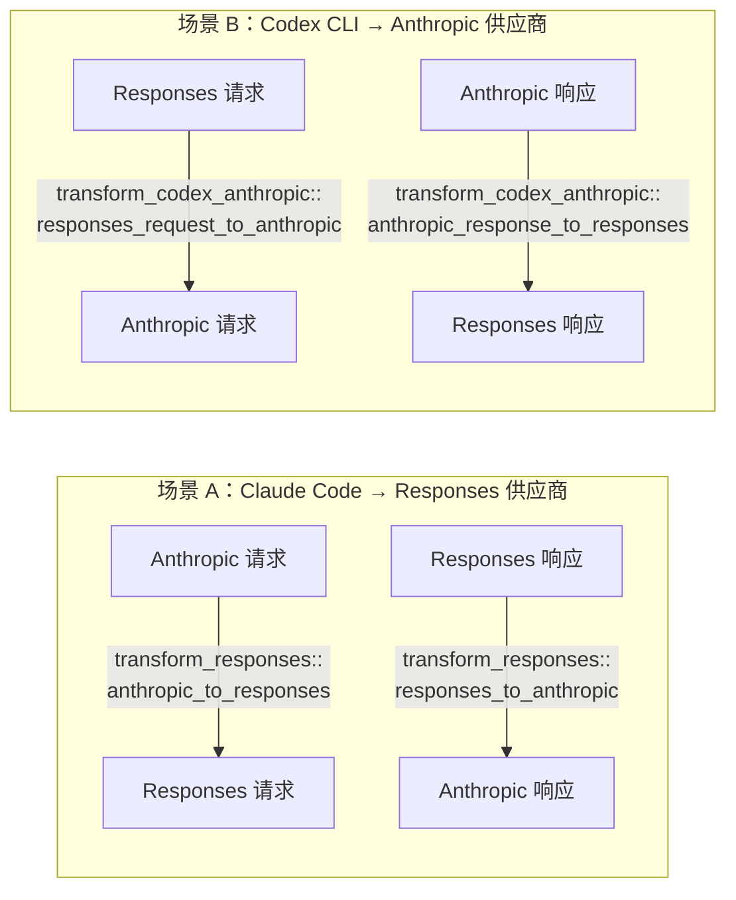

# Anthropic Messages ↔ OpenAI Responses 协议转换详解

> 对应源码：`src-tauri/src/proxy/providers/transform_responses.rs`（2217 行）+ `transform_codex_anthropic.rs`（2718 行）+ `reasoning_bridge.rs`（131 行）
> 场景：Anthropic Messages 协议与 OpenAI Responses 协议之间的双向桥接，覆盖两种镶嵌场景

## 总览：为什么是两个文件而不是一个

这是本系列里结构最特殊的一篇——协议转换的双向逻辑被拆进了**两个不对称**的文件，因为它们服务的是两种完全不同的代理场景：

| 场景 | 客户端说什么协议 | 上游供应商说什么协议 | 负责文件 |
|---|---|---|---|
| A | Claude Code（Anthropic Messages） | 只支持 Responses API 的供应商 | `transform_responses.rs` |
| B | Codex CLI（OpenAI Responses） | 只支持 Anthropic Messages 的供应商 | `transform_codex_anthropic.rs` |

`transform_codex_anthropic.rs` 文件头部注释直接点明了这个镜像关系：

> The direction is exactly the mirror of `transform_responses.rs`:
> - `transform_responses.rs`: Anthropic request → Responses request, Responses response → Anthropic response
> - this module: Responses request → Anthropic request, Anthropic response → Responses response

也就是说，**四个转换方向由两个文件各自负责一半**：



**调用链证据**：

场景 A（`claude.rs:395-408`）：路由判断 `api_format == "openai_responses"` 时调用 `transform_responses::anthropic_to_responses`；响应方向在 `claude.rs:955` 调用 `responses_to_anthropic`。

场景 B（`codex.rs:198-207` 判断 endpoint 匹配 `/responses` 且上游 provider 是 Anthropic 时触发；`forwarder.rs:1472-1475` 调用 `responses_request_to_anthropic`；响应方向在 `handlers.rs:1220-1299` 调用 `anthropic_response_to_responses`）。

**为什么 `transform_codex_anthropic.rs` 明显更重（2718 行 vs 分摊的请求方向代码量）**：因为场景 B 需要处理 Codex 客户端特有的一整套行为——工具命名空间注册（`CodexToolContext`）、custom_tool_call/tool_search_call 伪装、Anthropic 协议的多条强制约束（首条必须是 user、tool_result 必须在文本之前、thinking 签名只能引用紧邻的前一轮）。场景 A 的客户端（Claude Code 本身）天然遵守 Anthropic 协议规则，不需要这些防御性修复代码。

---

## 一、API 字段结构对比

### 1.1 场景 A：Claude Code Anthropic → Responses

> 入口函数：`anthropic_to_responses`（`transform_responses.rs:179-334`）。
> 客户端（Claude Code）发出 Anthropic Messages 格式，cc-switch 转换为 Responses API 格式后转发给上游供应商（如 MiniMax / 百炼等原生支持 Responses 的供应商）。

#### 总：一个真实请求长什么样

```jsonc
// ================ Claude Code 发出的 POST /v1/messages ================
// 注释标注了每个字段在 Responses 方向映射到的目标以及转换逻辑行号
// （transform_responses.rs）。
{
  // ─── 模型标识 ──────────────────────────────
  // → Responses: "model"（直接透传，line 188-189）
  "model": "claude-sonnet-5",

  // ─── 系统提示（独立顶层字段）─────────────────
  // → Responses: "instructions": "..."（line 192-208）
  // string 直接用作纯文本；content-block 数组时逐 item 提取 text 并用 \n\n 拼接。
  // 经 strip_leading_anthropic_billing_header 剥除计费元数据行（#2350）。
  // 空值不产生 instructions。
  "system": "You are a coding assistant with file access.",

  // ─── 对话历史 ──────────────────────────────
  // → Responses: "input": [...]（line 212-215，convert_messages_to_input:562）
  "messages": [
    // ── user 消息，单字符串 content ──────
    // → Responses: input message item {role:"user", content:"Read README.md"}
    {"role": "user", "content": "Read README.md"},

    // ── assistant 消息，含 tool_use + text ──
    // tool_use → 提升为独立的 function_call item（见 §2.1）
    // text → 留在 message item 内，type 改名 text→output_text
    {"role": "assistant", "content": [
      {"type": "text", "text": "Let me read the file."},
      {"type": "tool_use", "id": "call_read", "name": "Read",
       "input": {"file_path": "/path/to/file"}}
    ]},

    // ── user 消息含 image + document + tool_result ──
    // image→input_image（留在 message item 内）
    // document→input_file（留在 message item 内）
    // tool_result → 提升为独立的 function_call_output item
    {"role": "user", "content": [
      {"type": "image", "source": {"type": "base64", "media_type": "image/png", "data": "iVBORw0..."}},
      {"type": "document", "source": {"type": "base64", "media_type": "application/pdf", "data": "JVBERi0..."}},
      {"type": "tool_result", "tool_use_id": "call_read", "content": "File contents here."}
    ]},

    // ── assistant 消息含 thinking ──────
    // thinking/redacted_thinking → 经 reasoning_bridge 解码为独立的 reasoning item
    // （§2.3，包含 encrypted_content+summary→带签名、仅 summary→纯文本、都没有→丢弃）
    {"role": "assistant", "content": [
      {"type": "thinking", "thinking": "The file contains...",
       "signature": "ccswitch-openai-reasoning-v1:ey..."},
      {"type": "text", "text": "The file contains a list of items."}
    ]}
  ],

  // ─── 最大输出 token ────────────────────────
  // → Responses: "max_output_tokens"（line 217-219）
  // 直接重命名，Responses 全部模型统一用此字段。
  "max_tokens": 32000,

  // ─── 直接透传参数 ──────────────────────────
  // 以下字段不做类型映射，原样复制到 Responses 请求体：
  //   temperature（line 222-224）
  //   top_p（line 226-228）
  //   stream（line 229-231）
  "temperature": 0.7,
  "top_p": 0.9,
  "stream": true,

  // ─── Thinking 控制 ─────────────────────────
  // → Responses: "reasoning": {"effort": "..."}（line 234-239）
  // 仅当模型 supports_reasoning_effort() 返回 true 时才注入。
  // resolve_reasoning_effort() 映射表：
  //   {type:"adaptive"}                  → "xhigh"
  //   {type:"enabled", budget: <4000}   → "low"
  //   {type:"enabled", budget: 4000-15999} → "medium"
  //   {type:"enabled", budget: >=16000} → "high"
  "thinking": {"type": "enabled", "budget_tokens": 8192},

  // ─── stop_sequences ────────────────────────
  // → 丢弃（Responses API 不支持此参数，line 242）

  // ─── 工具定义 ──────────────────────────────
  // → Responses: tools[{type:"function", name, description, parameters}]
  // BatchTool 类型条目被过滤；input_schema → parameters（clean_schema 补全 type:object
  // 并剥除 format:uri）。空数组不写入 tools 字段。
  // （line 245-263）
  "tools": [
    {"name": "get_weather", "description": "获取天气",
     "input_schema": {"type": "object", "properties": {"city": {"type": "string"}}}},
    {"type": "BatchTool", "name": "batch_read"}  // 在 line 248 被过滤
  ],

  // ─── 工具选择策略 ──────────────────────────
  // → Responses: tool_choice（line 265-268，map_tool_choice_to_responses:336）
  //   {type:"any"}               → "required"
  //   {type:"tool", name:"X"}    → {"type":"function", "name":"X"}（扁平，不嵌套在 function 内）
  //   "auto" / "none" / 其他字符串 → 同名透传
  "tool_choice": "auto"
}

// ═══════ 以下字段由调用方注入，不出现在原始 Anthropic 请求中 ═══════
// prompt_cache_key：由 cache_key 参数注入，用于 OpenAI 兼容端点的缓存路由
//   （line 271-273）
// Codex OAuth 分支（is_codex_oauth=true，line 275-331）：
//   - 写入 store=false，兜底 include=["reasoning.encrypted_content"]
//   - 删除 max_output_tokens / temperature / top_p（codex-rs 结构体无这些字段）
//   - 兜底 instructions="" / tools=[] / parallel_tool_calls=false
//   - 强制覆盖 stream=true（codex-rs 硬编码 true，cc-switch SSE 层只处理流式）
//   - FAST mode 额外注入 service_tier="priority"
```

`content` block 速查表（`convert_messages_to_input`，transform_responses.rs:562）：

| block type | Anthropic 关键字段 | Responses 映射 |
|---|---|---|
| `text` | `text`（字符串） | 留在 message item 内，type 改名 text→output_text |
| `image` | `source`: `{type:"base64", media_type, data}` | 留在 message item 内，type 改名 image→input_image |
| `document` | `source`: `{type:"base64", media_type, data}` | 留在 message item 内，type 改名 document→input_file |
| `tool_use` | `id`, `name`, `input`（JSON 对象） | 提升为独立 `function_call` item |
| `tool_result` | `tool_use_id`, `content`（字符串或数组）, `is_error`? | 提升为独立 `function_call_output` item |
| `thinking` | `thinking`（文本）, `signature` | 解码为独立 `reasoning` item（含 encrypted_content+summary→带签名；仅 summary→纯文本） |
| `redacted_thinking` | `data`（加密内容） | 从 data 字段解码还原为 `reasoning` item |

#### 分：逐字段转换逻辑

每个字段在 `anthropic_to_responses`（line 179-334）中的处理方式：

```
字段                    处理                                              源码行
──────────────────────────────────────────────────────────────────────────────────
model                  直接透传                                          188-189
system                 string → instructions 纯文本                      192-208
                       content-block 数组 → 逐 item 提取 text，\n\n 拼接
                       空值跳过
messages               convert_messages_to_input()                      212-215
                       逐 content block 映射（提升/保留），见上方速查表
max_tokens             → max_output_tokens（无条件改名）                  217-219
temperature            直接透传                                          222-224
top_p                 直接透传                                          226-228
stream                直接透传                                          229-231
thinking               supports_reasoning_effort() 判断后，             234-239
                       resolve_reasoning_effort() → reasoning.effort
                       不支持或不传 thinking 时不注入 reasoning 字段
tools                  BatchTool 过滤 + input_schema → parameters        245-263
                       clean_schema 补 type:object、去 format:uri
tool_choice            map_tool_choice_to_responses()                    265-268
prompt_cache_key       cache_key 参数注入                                271-273
──────────────────────────────────────────────────────────────────────────────────
Codex OAuth 分支       特殊约束（仅 is_codex_oauth=true 时生效）            275-331
(is_codex_oauth=true)  store=false / include 兜底 reasoning.encrypted_
                       content / 删除 max_output_tokens,temp,top_p /
                       兜底 instructions,tools,parallel_tool_calls /
                       强制 stream=true / FAST mode → service_tier
──────────────────────────────────────────────────────────────────────────────────
```

#### 总：场景 A 核心就是"提升"

Anthropic → Responses 的请求方向转换本质上是在做"提升"——把嵌套在 messages 内部的 `tool_use`/`tool_result`/`thinking` block 拆出来变成 `input` 数组中的独立 item，字段改名（max_tokens→max_output_tokens、input_schema→parameters）是表象，`convert_messages_to_input` 的逐 block 遍历才是本质。

### 1.2 场景 B：Codex Responses → Anthropic

> 入口函数：`responses_request_to_anthropic`（`transform_codex_anthropic.rs:223-434`）。
> 客户端（Codex CLI）发出 Responses API 格式，cc-switch 转换为 Anthropic Messages 格式后转发给 Anthropic 上游。

#### 总：一个真实请求长什么样

```jsonc
// ================ Codex CLI 发出的 POST /v1/responses ================
// 注释标注了每个字段在 Anthropic 方向映射到的目标以及转换逻辑行号
// （transform_codex_anthropic.rs）。
{
  // ─── 模型标识 ──────────────────────────────
  // → Anthropic: "model"（直接透传，line 235-237）
  "model": "claude-sonnet-5",

  // ─── 系统指令 ──────────────────────────────
  // → Anthropic: "system"（line 239-260）
  // instructions 文本直接进 system_parts；同时扫描 input 中 role:"system"/"developer"
  // 的 message item，提取其文本一并合并进 system，用 \n\n 拼接。空值不产生 system。
  "instructions": "You are a coding assistant with file access.",

  // ─── 对话历史（扁平 input 数组）─────────────
  // → Anthropic: "messages": [...]（line 262-289，convert_input_to_messages:499）
  // 前置清理（line 275-277）：
  //   drop_incomplete_tool_turns（808-865）：删除不完整 tool_use↔tool_result 配对
  //     （compacted/resumed sessions 可能缺省，留在消息里会 400）
  //   ensure_leading_user_message（786-800）：Anthropic 要求首条必须是 user，
  //     否则插入 "(continuing the conversation)" 占位消息
  // 合并逻辑：function_call→tool_use 并入前一条 assistant 消息；
  //   function_call_output→tool_result 并入前一条 user 消息（push_tool_result_block
  //   保证 tool_result 排在该消息里其他 text 内容之前，满足 Anthropic 顺序要求）
  "input": [
    // ── message item（由 role 判别）─────────
    // → Anthropic: {role:"user", content:"Read README.md"}
    {"role": "user", "content": "Read README.md"},

    // ── function_call item ────────────────
    // → Anthropic: 合并进 assistant 消息的 tool_use content block
    {"type": "function_call", "call_id": "call_1", "name": "Read",
     "arguments": "{\"file_path\":\"/path/to/file\"}"},

    // ── function_call_output item ─────────
    // → Anthropic: 合并进 user 消息的 tool_result content block
    //   （push_tool_result_block 保证排在 text 等其他 content 之前）
    {"type": "function_call_output", "call_id": "call_1",
     "output": "File contents here."},

    // ── reasoning item ────────────────────
    // → Anthropic: 经 reasoning_bridge 编码为 thinking/redacted_thinking block
    // （§2.3，reasoning_bridge.rs:48-93）
    // 有 encrypted_content + 有 summary → thinking block（带 signature）
    // 有 encrypted_content + 无 summary → redacted_thinking block
    // 无 encrypted_content + 有 summary → 普通 thinking（无签名）
    // 都没有 → 丢弃（不产出任何 block）
    {"type": "reasoning", "id": "rs_1",
     "summary": [{"type": "summary_text", "text": "现在我知道文件内容了"}]}

    // 其余 input item 类型见下方 type 速查表
  ],

  // ─── 最大输出 token ────────────────────────
  // → Anthropic: "max_tokens"（line 302-306）
  // 直接重命名。缺失时注入 default_max_tokens 兜底值（Anthropic 必填，缺失 400）。
  "max_output_tokens": 32000,

  // ─── Reasoning 控制 ────────────────────────
  // → Anthropic: "thinking"（line 293-371）
  // reasoning.effort → 先经 effort_to_thinking_budget（line 33-48）转为 token 预算：
  //   "xhigh"→24576, "high"→16384, "medium"→8192, "low"→4096, "minimal"→2048
  // 再经 ceiling = max_tokens/2 限制，<1024 则禁用 thinking（line 349-353）。
  // adaptive 模型（uses_adaptive_thinking）→ adaptive thinking；
  //   非 adaptive 模型 → {type:"enabled", budget_tokens}。
  // reasoning.effort 显式 "none" → {type:"disabled"}。
  "reasoning": {"effort": "high"},

  // ─── 直接透传参数 ──────────────────────────
  // temperature / top_p：仅 thinking 停用时才写入（line 365-371），
  //   Anthropic 在 thinking 开启时不接受这两个参数。
  "temperature": 0.7,
  "top_p": 0.9,

  // ─── stream ────────────────────────────────
  // → Anthropic: 直接透传（line 373-375）
  "stream": true,

  // ─── 工具定义 ──────────────────────────────
  // → Anthropic: tools[{name, description, input_schema, strict?}]
  // CodexToolContext 将 Responses tools 展开为 Chat tools 格式（含 namespace 注册、
  //   custom_tool_call/tool_search_call 伪装），再通过 chat_tool_to_anthropic_tool
  //   （line 436-458）转为 Anthropic 格式：
  //     function.parameters → input_schema
  //     function.name/description → name/description
  //     function.strict → strict（可选）
  //   名称含空值或不支持的 hosted 工具在 CodexToolContext 阶段已被过滤。
  //   工具集为空时不写入 tools 字段，也不写入 tool_choice（line 384-387）。
  "tools": [
    {"type": "function", "name": "get_weather",
     "description": "获取指定城市的天气信息",
     "parameters": {
       "type": "object",
       "properties": {"city": {"type": "string", "description": "城市名称"}},
       "required": ["city"]
     }}
  ],

  // ─── 工具选择策略 ──────────────────────────
  // → Anthropic: tool_choice（line 393-431，map_tool_choice_to_anthropic:461）
  //   "required"  → {type:"any"}
  //   "auto"      → {type:"auto"}
  //   "none"      → {type:"none"}
  //   {type:"function", name:"X"} → {type:"tool", name: upstream_name}
  //     （name 经 CodexToolContext 映射为上游扁平名称）
  //   {type:"custom", name:"X"} → 同上（伪造成 function）
  //   {type:"tool_search"} → 伪装成 {type:"tool", name: TOOL_SEARCH_PROXY_NAME}
  //   类型未知的 object → 降级为 {type:"auto"}
  // 强制工具选择（type="any" 或 "tool"）且 thinking 开启时：
  //   - 无法禁用 thinking 的模型 → 直接报错 InvalidRequest
  //   - 可禁用 → 覆盖 thinking={type:"disabled"} 并恢复 temperature/top_p
  //     （line 400-418）
  "tool_choice": "auto",

  // ─── 并行工具调用 ──────────────────────────
  // → Anthropic: parallel_tool_calls=false 时，给 tool_choice 附加
  //   disable_parallel_tool_use=true（line 422-430）
  //   若无现有 tool_choice → 先补 {type:"auto"} 再挂 disable_parallel_tool_use
  "parallel_tool_calls": true
}
```

`input` item type 速查表（`convert_input_to_messages`，transform_codex_anthropic.rs:499）：

| type | 携带字段 | Anthropic 映射 |
|---|---|---|
| `message` | `role` + `content`（string 或 content parts 数组） | 对应 role 的 message |
| `function_call` | `call_id`, `name`, `arguments`（JSON string） | 合并进 assistant 消息的 `tool_use` content block |
| `function_call_output` | `call_id`, `output`（string 或 array） | 合并进 user 消息的 `tool_result` content block（排在 text 之前） |
| `custom_tool_call` / `custom_tool_call_output` | `call_id`, `name`, `input`（自由文本） | 同 function_call，经 CodexToolContext 映射上游名称 |
| `tool_search_call` / `tool_search_output` | `call_id`, `arguments`（`{query, limit}`） | 同上，伪装成名为 `tool_search` 的 tool_use/tool_result |
| `reasoning` | `id`, `summary`（structured parts）, 可选 `encrypted_content` | 经 reasoning_bridge 编码为 `thinking`/`redacted_thinking` block（§2.3） |

#### 分：逐字段转换逻辑

每个字段在 `responses_request_to_anthropic`（line 223-434）中的处理方式：

```
字段                    处理                                              源码行
──────────────────────────────────────────────────────────────────────────────────
model                  直接透传                                          235-237
instructions           string → 拼入 system_parts                        239-245
input 中的 system/      提取文本，与 instructions 用 \n\n 合并进           248-257
developer 消息          统一的 Anthropic system
system 结果             system_parts 非空时写入 result["system"]          258-260
input                  convert_input_to_messages()（函数定义:499）        262-269
                       逐 item 合并为 Anthropic messages
前置清理                drop_incomplete_tool_turns（808-865）             275-277
                       删除不完整 tool_use↔tool_result 配对
                       ensure_leading_user_message（786-800）
                       首条非 user 时插入 "(continuing the conversation)"
max_output_tokens      → max_tokens（缺失时注入 default_max_tokens）      302-306
reasoning.effort       effort_to_thinking_budget（33-48）量化为预算      293, 307-371
                       → thinking（ceiling=max_tokens/2，<1024 禁用）
                       adaptive 模型 → {type:"adaptive"} + 可选 output_config
                       显式禁用 → {type:"disabled"}
temperature            仅 thinking 停用时写入（line 365-371）              364-366
top_p                 同上                                              368-370
stream                直接透传                                          373-375
tools                  CodexToolContext → chat_tools() →                 378-387
                       chat_tool_to_anthropic_tool（436-458）
                       为空时不写入（避免无 tools 时传 tool_choice 导致 400）
tool_choice            map_tool_choice_to_anthropic（461-431）            393-431
                       强制工具 + thinking 开启 → 禁用 thinking
                       或模型不可禁用时报错 InvalidRequest
parallel_tool_calls    =false → tool_choice.disable_parallel_tool_use    422-430
                       无 tool_choice 时先补 {type:"auto"}
──────────────────────────────────────────────────────────────────────────────────
```

#### 总：场景 B 核心是"合并"加防御修复

Responses → Anthropic 的请求方向转换本质上是把扁平 input 数组的独立 item（function_call、function_call_output、reasoning）重新"合并"回嵌套的 messages 结构，同时做 Anthropic 协议独有的防御性修复（首条 user、完整 tool turn 配对、tool_result 排 text 之前），所以本方向代码量明显更大（2718 行 vs 分摊的请求方向代码量）。

---

## 二、消息 ↔ input 数组的双向映射

### 2.1 提升：`convert_messages_to_input`（transform_responses.rs:562，场景 A 请求方向）

逐 block 类型处理：
- `text`/`image`/`document` → 留在 message item 内，type 改名（image→input_image，document→input_file）
- `tool_use` → **提升**为独立的 `function_call` item
- `tool_result` → **提升**为独立的 `function_call_output` item
- `thinking`/`redacted_thinking` → 通过 reasoning_bridge **解码**还原为独立的 `reasoning` item（详见 §2.3）

### 2.2 合并：`convert_input_to_messages`（transform_codex_anthropic.rs:499，场景 B 请求方向）

反过程，且要处理"按 role 重新分组"：
- `function_call` → `tool_use` block，合并进前一条 assistant 消息（`push_block` 辅助函数按 role 分组）
- `function_call_output` → `tool_result` block，合并进前一条 user 消息，且 Anthropic 要求 tool_result 必须排在该消息里其他 text 内容**之前**（`push_tool_result_block` 专门保证这个顺序）
- `reasoning`（含 encrypted_content）→ 通过 reasoning_bridge **编码**还原为 `thinking`/`redacted_thinking` block

### 2.3 reasoning ↔ thinking：本篇文档最重要的机制，三套编解码通道

这里有**三个**独立的 base64 编解码机制，服务不同的转换子方向，务必分清楚：

#### 通道 1：`reasoning_bridge.rs` — Responses reasoning item ↔ Anthropic thinking block（场景 A 专用）

```rust
const OPENAI_REASONING_ITEM_PREFIX: &str = "ccswitch-openai-reasoning-v1:";
```

**Responses → Anthropic**（`anthropic_block_from_openai_reasoning_item`，reasoning_bridge.rs:48-80）：
```
有 encrypted_content + 有 summary 文本  → thinking block，signature = 前缀 + base64(整个 reasoning item JSON)
有 encrypted_content + 无 summary 文本  → redacted_thinking block，data = 同上编码
无 encrypted_content + 有 summary 文本  → 普通 thinking block（无 signature，因为没有加密内容需要保存）
无 encrypted_content + 无 summary 文本  → None（不产出任何 block）
```
调用点：`transform_responses.rs:825-828`（`responses_to_anthropic` 响应方向）。

**Anthropic → Responses**（`openai_reasoning_item_from_anthropic_block`，reasoning_bridge.rs:82-93）：
```
thinking block:          从 signature 字段解码（若无 ccswitch 前缀则返回 None）
redacted_thinking block: 从 data 字段解码
```
调用点：`transform_responses.rs:673-674`（`convert_messages_to_input` 请求方向）。

**往返一致性**：**理论完全无损**。完整的 reasoning item（`id`/`summary`/`encrypted_content` 全部字段）被整体序列化再 base64（用的是 `URL_SAFE_NO_PAD` 变体），解码后得到语义等价的 JSON（序列化字节本身受 key 排序影响，但反序列化还原出的字段和值逐一对应）——单元测试 `reasoning_bridge.rs:100-130` 验证了 round-trip。

#### 通道 2：`transform_codex_anthropic.rs` 内的镜像编码 — Anthropic thinking block ↔ Responses reasoning item（场景 B 专用）

```rust
const ANTHROPIC_THINKING_ENCRYPTED_PREFIX: &str = "ccswitch-anthropic-thinking-v1:";  // transform_codex_anthropic.rs:25，编解码函数在 line 66-113
```

方向与通道 1 恰好相反（因为场景 B 是 Responses 客户端对接 Anthropic 供应商）：

**Anthropic → Responses**（`responses_reasoning_item_from_anthropic_block`，line 96-113，响应方向）：把带 signature 的 thinking 或带 data 的 redacted_thinking block 整体编码进新建 reasoning item 的 `encrypted_content` 字段。

**Responses → Anthropic**（`decode_anthropic_thinking_block`，line 87-94，请求方向）：从 `encrypted_content` 解码还原原始 block；解码后**再重新编码校验一次**，确保内容一致（防止未签名的 thinking block 被伪造插入请求里）。

**往返一致性**：同样**理论无损**，且多了一层自校验。

#### 为什么需要两套独立前缀而不是共用一套

因为两套编码承载的"载荷协议"不同：通道 1 编码的是 OpenAI reasoning item 的 JSON 结构，通道 2 编码的是 Anthropic thinking/redacted_thinking block 的 JSON 结构。用不同前缀可以让解码端一眼识别"这段 base64 是哪种协议的原始数据"，避免跨场景误解码。

#### 无签名的原生 thinking block 是有损的

如果客户端发来的 thinking block 是**真正的 Claude API 原生输出**（没有 ccswitch 前缀的签名，是 Anthropic 服务端自己签发的），在 `convert_messages_to_input`（通道 1 的解码路径）里会被**静默丢弃**——因为 `openai_reasoning_item_from_anthropic_block` 只认自己的前缀，识别不出来就返回 None，对应的 `_ => {}` 分支什么也不做（transform_responses.rs:687）。

**这解释了"服务商切换"场景为何最容易触发签名失效**：假设客户端用 Anthropic 协议接入，代理转给 Responses 上游，收到的 reasoning item 被通道 1 编码进 thinking block 的 signature（这个签名是 cc-switch 自己造的，不是 Anthropic 服务端颁发的）。客户端下一轮把这个 thinking block 带回来，如果这次代理把请求路由给了**另一个真正的 Anthropic 供应商**，该供应商会尝试校验这个签名——但签名格式对它来说完全不认识，校验失败返回 400。这正是 `05-reasoning-thinking-tools-cross-protocol.md` 里 `thinking_rectifier.rs` 需要存在的原因：它负责在这类签名冲突发生后，把请求里的 thinking block 整体删掉再重试。

### 2.4 tool_use ↔ function_call

**Anthropic → Responses**（transform_responses.rs:625-645）：
```json
// 输入: {"type":"tool_use","id":"call_123","name":"get_weather","input":{"location":"Tokyo"}}
// 输出: {"type":"function_call","call_id":"call_123","name":"get_weather","arguments":"{\"location\":\"Tokyo\"}"}
```
`id`→`call_id`（值不变，字段名变）；`input`（对象）→`arguments`（字符串，走 `canonical_json_string`）。这个 item 从 message content 里被**提升**为独立顶层 item。

**Responses → Anthropic**（transform_codex_anthropic.rs:524-558）：
```json
// 输入: {"type":"function_call","call_id":"call_1","name":"get_weather","arguments":"{\"city\":\"Tokyo\"}","namespace":"mcp_files"}
// 输出: {"type":"tool_use","id":"call_1","name":"mcp_files__get_weather","input":{"city":"Tokyo"}}
```
有 `namespace` 时，name 通过 `tool_context.chat_name_for_response_function` 展开成 `namespace__name` 格式；无 namespace 保持原样。

### 2.5 tool_result ↔ function_call_output

**Anthropic → Responses**（`anthropic_tool_result_to_responses_output`，transform_responses.rs:78-140）：

```json
// 简单情况: {"type":"tool_result","tool_use_id":"call_1","content":"Sunny, 25°C"}
// →         {"type":"function_call_output","call_id":"call_1","output":"Sunny, 25°C"}
```

多模态情况下逐 block 映射：`text`→`{"type":"input_text","text":...}`；`image`→通过 `anthropic_image_to_responses_part`；`document`→通过 `anthropic_document_to_responses_part`；未知类型兜底为 `canonical_json_string` 序列化的文本。`is_error:true` 时会在 output 前插入标记文本 `"[cc-switch:tool-result-error]"`（这是一个内部约定标记，用来在没有专门错误字段的场景下传递"这是一次失败的工具调用"这个语义）。

**Responses → Anthropic**（`tool_result_content_from_responses_item`，transform_codex_anthropic.rs:721-780）：反向映射，`input_text` 里的文本若命中上面提到的错误标记，会被还原成 `is_error:true`；`input_image`/`input_file`→分别通过 `image_block_from_input_image`/`document_block_from_input_file` 还原成 Anthropic 的 image/document block。

**关键点：这个方向的图片/多模态转换是无损的**——跟 `02-chat-to-anthropic.md` 里 Chat Completions 方向"多模态工具结果被序列化降级成纯文本"完全不同。原因是 Responses 协议的 `function_call_output.output` 本身就支持结构化的 parts 数组（`input_image`/`input_file` 这些类型），不像 Chat Completions 的 tool 消息 content 只认字符串。

### 2.6 图片 / 文档字段映射

**Anthropic → Responses**：
```
{"type":"image","source":{"type":"base64","media_type":"image/png","data":"abc"}}
  → {"type":"input_image","image_url":"data:image/png;base64,abc"}

{"type":"document","title":"manual.pdf","source":{"type":"base64","media_type":"application/pdf","data":"..."}}
  → {"type":"input_file","file_data":"data:application/pdf;base64,...","filename":"manual.pdf"}
```

**Responses → Anthropic**（反向，字段名对称）：
```
{"image_url":"data:image/png;base64,abc"} → {"type":"image","source":{"type":"base64","media_type":"image/png","data":"abc"}}
{"file_data":"data:application/pdf;base64,...","filename":"manual.pdf"} → {"type":"document","source":{...},"title":"manual.pdf"}
```
两个方向都同时支持 base64 内嵌和 HTTP URL 两种来源；文件名字段 Anthropic 用 `title`，Responses 用 `filename`，缺失时默认兜底为 `"document.pdf"`。

### 2.7 custom_tool_call / tool_search_call 在 Anthropic 侧的落地

Anthropic 协议本身没有这两种内置工具类型的概念，所以只存在**响应方向**（场景 B，Responses → Anthropic）的处理（transform_codex_anthropic.rs:560-602）：
- `custom_tool_call` → 转成普通 `tool_use`，name 保持不变，input 包装成 `{"input": original_input}`
- `tool_search_call` → 转成 name 固定为 `"tool_search"` 的 `tool_use`

这跟 `01-chat-to-responses.md` 里 Chat Completions 方向的伪装策略是一致的思路，只是落地成的"伪装目标"从 function tool call 换成了 Anthropic 的 tool_use。

---

## 三、首条消息必须是 user：`ensure_leading_user_message`（transform_codex_anthropic.rs:786-800）

```rust
if !messages.is_empty() && !leads_with_user {
    messages.insert(0, json!({
        "role": "user",
        "content": [{ "type": "text", "text": "(continuing the conversation)" }]
    }));
}
```

**策略是插入一条合成消息**，不是前移或修改任何现有消息。这是 Anthropic Messages API 的硬约束（`messages[0].role` 必须是 `"user"`，否则 400），而 Responses 协议的 `input` 数组没有这个限制，可以以任意类型开头。

**触发场景**：Codex 的会话压缩/恢复可能从 assistant 消息开始；纯工具循环场景（`function_call`+`function_call_output` 反复交替，没有显式 user 消息）；或者经过 `drop_incomplete_tool_turns`（下面讲）清理后第一轮恰好剩下的是 assistant 消息。

这个函数只出现在场景 B 的文件里——因为场景 A 的输入端本身就是 Anthropic 协议，天然已经满足这个约束，不需要额外修复。

---

## 四、不完整工具调用轮次的丢弃：`drop_incomplete_tool_turns`（transform_codex_anthropic.rs:808-865）

**"完整"的判定**（同时满足）：
1. assistant 消息里所有 `tool_use.id` 都非空且互不重复
2. 紧跟的下一条 user 消息里所有 `tool_result.tool_use_id` 都非空且互不重复
3. 两个 ID 集合**完全相等**（每个 tool_use 都有对应 tool_result，反之亦然）

**丢弃策略**：
- 完整轮次：assistant + user 一起保留
- 不完整轮次：assistant 及其 tool_use block **整体不进入**结果；紧跟的 user 消息里，把 tool_result block 删掉，只保留该消息里其余的非 tool_result 内容（如果删完还有内容就保留这条消息，否则整条消失）
- 孤立出现（不在 assistant+tool_use 之后）的 tool_result：同样被删除，只保留消息里其余内容

**为什么要这样处理**：Anthropic 对 tool_use/tool_result 的配对有严格校验，任何缺一半的轮次直接发过去都会被 Anthropic 服务端拒绝。这个清洗步骤保证了进入下一步转换的消息序列一定是"配对完整"的。

---

## 五、Thinking 能力的位置依赖：`trailing_turn_supports_thinking`（transform_codex_anthropic.rs:895-952）

Anthropic 对 thinking 有严格的位置规则：thinking block 必须出现在 assistant content 的末尾（在 tool_use 之后），且后续的 tool_result 轮次要"重放"这个 thinking 的签名才能让模型继续使用 thinking 能力。这个函数判断"当前对话末尾是否处在一个允许开启新 thinking 的位置"：

```
如果最后一条消息不是 user 消息                              → false
如果最后一条 user 消息里没有 tool_result（纯文本轮次）        → true（可以开新的 thinking）
如果最后一条 user 消息里有 tool_result：
    必须倒数第二条消息是 assistant，且该 assistant 的 content
    里有 thinking/redacted_thinking block，且它的 tool_use id
    集合完整覆盖这批 tool_result 的 tool_use_id（覆盖并行调用场景）  → true，否则 false
```

**关键设计约束**（代码注释原话）：
> A tool-result turn answers the immediately preceding assistant tool-use turn. Looking any farther back can pick up an unrelated signed thinking block and incorrectly re-enable thinking for an unsigned tool call.

也就是**只看紧邻的前一轮**，不会向前多轮扫描——避免误把一个不相关的、多轮之前的已签名 thinking block 当作"当前工具调用合法拥有 thinking 签名"的证据，错误地重新开启 thinking 能力。

---

## 六、effort 映射对照表

### 6.1 Responses effort → Anthropic budget_tokens（场景 B 请求方向，transform_codex_anthropic.rs:33-50）

```
"minimal" / "low"   → budget_tokens: 2048,  output_config.effort: "low"
"medium"            → budget_tokens: 8192,  output_config.effort: "medium"
"high"              → budget_tokens: 16384, output_config.effort: "high"
"xhigh" / "max"     → budget_tokens: 24576, output_config.effort: "max"
```

budget 还会被裁剪（line 349-352）：`ceiling = max_tokens / 2`（保证可见回答有空间），`thinking_budget = min(thinking_budget, ceiling)`；如果裁剪后小于 1024（Anthropic API 硬约束的最低值），直接**整体禁用** thinking。

### 6.2 Anthropic budget_tokens → Responses effort（场景 A 请求方向，由 `transform.rs::resolve_reasoning_effort` 提供，详见 `02-chat-to-anthropic.md` §5.2）

```
budget_tokens < 4000      → "low"
4000 <= budget_tokens < 16000 → "medium"
budget_tokens >= 16000    → "high"
thinking.type=="adaptive" → "xhigh"
```
（这套阈值定义在 `transform.rs::resolve_reasoning_effort`，详见 `02-chat-to-anthropic.md` §5.2。）

两套映射表的分界点并不对称（§6.1 的 high 档从 16384 起步，§6.2 的 high 档从 16000 起步；§6.1 的 medium 上限是 8192，§6.2 的 medium 上限是 16000）——这印证了"两个方向各自独立设计、按启发式经验值调整"而非"共用一张精确的双射表"的现实。

---

## 七、响应方向转换：stop_reason / status 映射

### 7.1 Responses → Anthropic（`map_responses_stop_reason`，transform_responses.rs:358-376）

| Responses status | 是否有 tool_use | Anthropic stop_reason |
|---|---|---|
| `completed` | 有 | `tool_use` |
| `completed` | 无 | `end_turn` |
| `incomplete` + reason=`max_output_tokens`/`max_tokens` | -- | `max_tokens` |
| `incomplete` + 其他/无 reason | -- | `end_turn` |
| 其他/error | -- | `end_turn` |

### 7.2 Anthropic → Responses（`map_anthropic_stop_reason_to_status`，transform_codex_anthropic.rs:116-132）

| Anthropic stop_reason | Responses status | incomplete_details.reason |
|---|---|---|
| `end_turn` / `tool_use` | `completed` | -- |
| `max_tokens` | `incomplete` | `max_output_tokens` |
| `refusal` | `incomplete` | `content_filter` |
| `model_context_window_exceeded` | `incomplete` | `max_output_tokens` |
| `pause_turn`（理论不应出现） | `completed`（附带告警日志） | -- |

### 7.3 usage 字段映射——同一套"三桶模型"在两个方向各自实现一次

**Responses → Anthropic**（`build_anthropic_usage_from_responses`，transform_responses.rs:409-551）：Responses 的 `input_tokens` 含缓存，需要 `input_tokens.saturating_sub(cache_read).saturating_sub(cache_creation)` 才是 Anthropic 语义下"刨除缓存"的净输入量。cache_read/cache_creation 分别从 `input_tokens_details.cached_tokens`/`cache_write_tokens`（或降级到 `prompt_tokens_details` 下同名字段）提取。

**Anthropic → Responses**（`build_responses_usage_from_anthropic`，transform_codex_anthropic.rs:144-195）：反向推导，`input_tokens(Responses) = fresh_input + cache_read + cache_creation`；额外还处理了 `output_tokens_details.reasoning_tokens`（来自 Anthropic 的 `output_tokens_details.thinking_tokens`）——这是"思考过程消耗的 token 数"这个统计维度在两个协议间的对应。

### 7.4 `validate_responses_terminal_status`（transform_responses.rs:388-406）—— 一个容易被忽略但很重要的校验

```rust
match status {
    Some("failed") => Err(...),
    Some("cancelled") => Err(...),
    _ if has_error => Err(...),   // 有 error 字段但 status 既不是 failed 也不是 cancelled
    _ => Ok(()),
}
```

**为什么需要这个校验**：如果不主动检查 `status: "failed"`，这类响应体里的 `output` 数组很可能是空的，如果不拦截就会被当作一次"正常完成、只是没说什么话"的 `end_turn` 空消息返回给客户端——用户会看到一个诡异的空回复，而不是一个明确的错误提示。这是代码注释里明确提到的一个坑，主动做了防御。

### 7.5 SSE 降级聚合器：`anthropic_sse_to_message_value`（transform_codex_anthropic.rs:1259-1438）

这不是常规意义上的流式转换器，而是一个**异常路径的兜底聚合器**。正常情况下流式响应会走专门的 streaming 模块（见 `04-sse-streaming-transform.md`）；但如果上游返回的 body 实际是 SSE 格式，却没有把 `Content-Type` 正确标记为 `text/event-stream`，handler 层的路由判断会误判成非流式响应，走到 JSON parse 失败的分支。这个函数就是这种"漏检 SSE"场景下的补救：把整段 SSE 文本（`message_start`/`content_block_delta`/`message_stop` 等一系列事件）解析聚合成一个完整的 Anthropic message JSON，再交给 `anthropic_response_to_responses` 走正常的响应转换路径。

---

## 八、Tool 定义转换：`chat_tool_to_anthropic_tool`（transform_codex_anthropic.rs:436-458）

输入格式实际上是**Chat Completions 格式**的工具定义（因为 `CodexToolContext` 内部统一用 Chat 格式存储所有已注册工具，参见 `01-chat-to-responses.md`），不是裸的 Responses 格式：

```json
// 输入 (Chat 嵌套格式): {"type":"function","function":{"name":"get_weather","description":"...","parameters":{...},"strict":true}}
// 输出 (Anthropic 扁平格式): {"name":"get_weather","description":"...","input_schema":{...},"strict":true}
```

而场景 A 方向的工具转换（Anthropic → Responses，transform_responses.rs:245-263）更直接：

```json
// 输入: {"name":"get_weather","description":"Get weather","input_schema":{...}}
// 输出: {"type":"function","name":"get_weather","description":"Get weather","parameters":{...}}
```
`input_schema`→`parameters` 字段改名，中间同样过一遍 `clean_schema` 清洗（复用 `transform.rs` 里的实现，详见 `02-chat-to-anthropic.md` §4）。

---

## 九、Codex OAuth 特殊分支

`anthropic_to_responses`（transform_responses.rs:275-331）里有一段专门为 ChatGPT Plus/Pro 反代后端（Codex OAuth 场景）服务的分支：主动**删除** `max_output_tokens`/`temperature`/`top_p` 三个字段，并**强制注入** `store: false`、`stream: true`、`include: ["reasoning.encrypted_content"]`。

原因是这个特定后端严格复刻了 OpenAI 官方 codex-rs 客户端发出的请求结构，容不下这几个"看起来合理但官方客户端从不发送"的字段；而 `include: ["reasoning.encrypted_content"]` 是显式请求上游在 reasoning item 里带上加密内容——如果不显式要求，某些后端默认不返回这个字段，导致 §2.3 的编码机制拿不到原料，reasoning 保留会退化成"只有摘要文本、没有可编码的加密内容"。

---

## 总结：设计哲学回顾

1. **两个文件合起来才是一套完整的双向桥**：不是因为偷懒拆分，而是因为两个方向服务的客户端约束完全不同——场景 A 的输入端天然合规，场景 B 的输入端（Codex）需要一整套防御性修复代码来满足 Anthropic 的强制规则。
2. **消息结构转换的本质是"提升"与"合并"两种反向操作**：嵌套的 Anthropic content block 拆成扁平的 Responses item 是提升，反过来按 role 重新分组是合并，理解这一点就能推断出任何新增 block 类型该怎么处理。
3. **reasoning 保留是本篇最精细的设计**：两套独立前缀的 base64 通道分别服务两个转换方向，理论上都做到完全无损往返；但对没有 ccswitch 签名的原生 thinking block 是有损的（静默丢弃）——这正是签名整流器存在的深层原因。
4. **场景 B 的防御性代码密度远高于场景 A**：`ensure_leading_user_message`、`drop_incomplete_tool_turns`、`trailing_turn_supports_thinking` 这些函数全部只出现在 `transform_codex_anthropic.rs`，因为 Anthropic 协议的强制约束需要在"任意格式的 Responses 输入"和"严格校验的 Anthropic 上游"之间架起一层安全网，场景 A 不需要这层，因为它的输入端本身就是被约束的那个协议。
