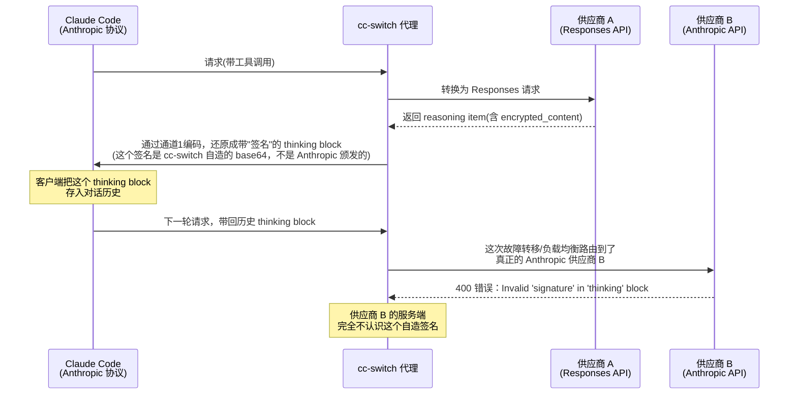
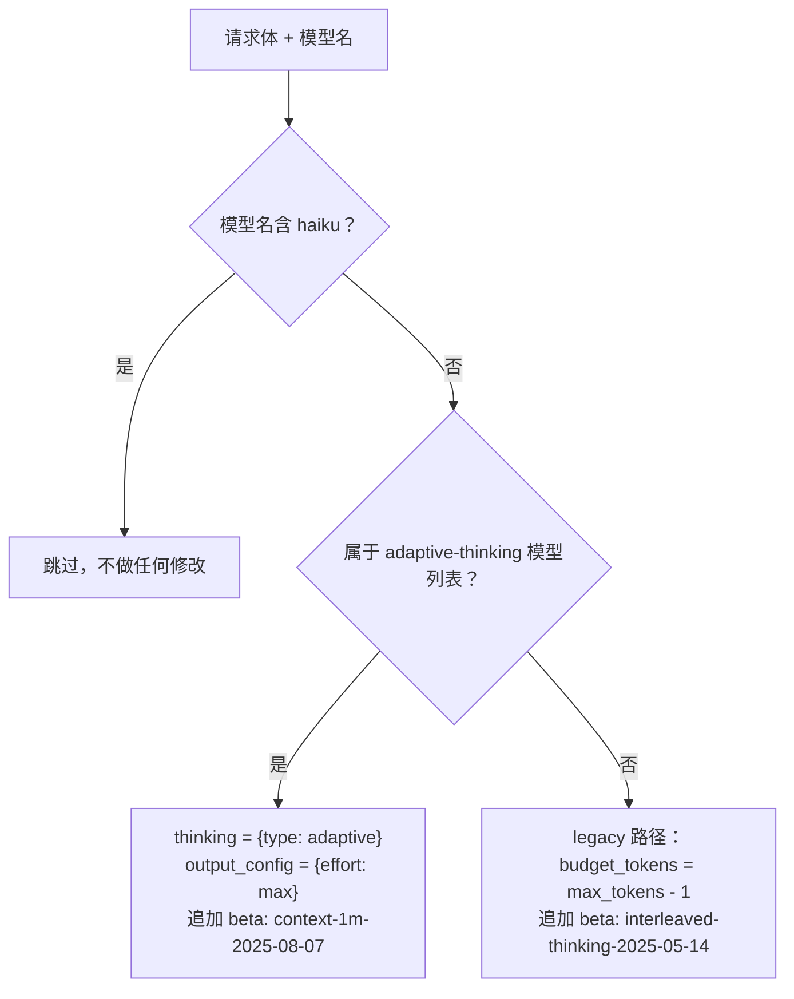
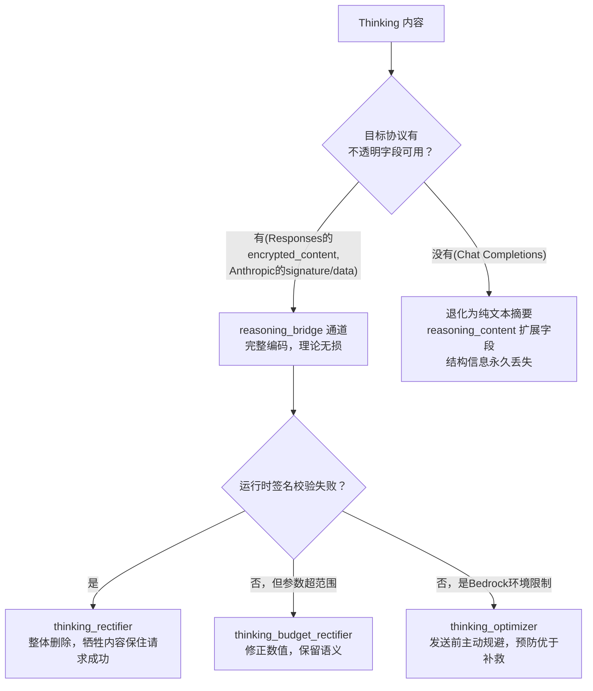

# Reasoning/Thinking 跨协议保留与 Tools 跨模型差异详解

> 对应源码：`src-tauri/src/proxy/providers/reasoning_bridge.rs`（131 行）+ `src-tauri/src/proxy/thinking_rectifier.rs`（722 行）+ `src-tauri/src/proxy/thinking_budget_rectifier.rs`（365 行）+ `src-tauri/src/proxy/thinking_optimizer.rs`（338 行）+ `src-tauri/src/proxy/providers/gemini_schema.rs`（338 行）
> 场景：横向串联前四篇文档都会遇到的两个共性难题——"模型的思考过程"和"工具定义/调用"在三种协议、多个模型厂商之间的兼容性处理

## 总览：为什么这是最后一篇，也是横向的一篇

前四篇文档各自讲清楚了一对协议方向的转换细节，但都留了一个共同的坑没有深挖：**thinking/reasoning 这类"模型思考过程"信息，在跨协议传递时会遇到签名校验失败怎么办？** 以及**tools 的 JSON Schema 在不同模型厂商（尤其是 Gemini）之间到底有多大差异？** 这两个问题不属于任何单一转换方向，而是横跨所有方向的共性基础设施问题，所以单独成篇。

核心矛盾在于：Anthropic 的 thinking block 带有一个由 Anthropic 服务端颁发的**签名**（`signature` 字段），这个签名会被同一个 Anthropic 服务端在后续请求里**重新校验**。一旦这个 thinking block 经过跨协议的转换、编码、或者被路由到了另一个 Anthropic 供应商，签名校验大概率会失败。前面几篇文档提到的"reasoning_bridge 无损编解码"解决的是"如何在协议间搬运 thinking 内容而不丢失结构"，但没有解决"搬运之后签名还能不能通过校验"这个问题——这正是本篇要讲的整流器（rectifier）和优化器（optimizer）的用武之地。

工具方面的核心矛盾则更简单：不同模型厂商对 JSON Schema 的支持程度天差地别，Gemini 尤其严格，只认一个受限的关键字子集，其余关键字必须走一个完全不同的通道才能传递。

---

## 一、三种协议的 Thinking 表示法总览

| 维度 | Anthropic Messages | OpenAI Responses | OpenAI Chat Completions |
|---|---|---|---|
| 思考块类型 | `thinking` block（明文+签名）/ `redacted_thinking` block（纯加密数据） | `reasoning` item（`summary` 数组 + `encrypted_content`） | 无标准字段 |
| 明文思考文本 | `block.thinking` 字符串 | `item.summary[].text` 分散在多个 part 里 | 靠非标准扩展字段 `reasoning_content` |
| 加密/签名机制 | `block.signature`（非对称签名，由 Anthropic 服务端颁发并校验） | `item.encrypted_content`（加密内容，供应商自己维护） | 无 |
| 完整结构承载 | block 本身即容器 | item 本身即容器 | 无容器，只能靠文本近似 |

前面几篇文档已经讲过的编解码通道汇总一览（详见各自文档，这里不重复展开）：

- 通道 1（`reasoning_bridge.rs`，前缀 `ccswitch-openai-reasoning-v1:`）：Responses reasoning item ↔ Anthropic thinking/redacted_thinking block，理论无损，见 `03-anthropic-responses-bidirectional.md` §2.3
- 通道 2（`transform_codex_anthropic.rs` 内，前缀 `ccswitch-anthropic-thinking-v1:`）：Anthropic thinking block ↔ Responses reasoning item（反方向的镜像编码），理论无损，见同上
- Chat Completions 方向（`transform_codex_chat.rs` / `transform.rs`）：只保留纯文本摘要，结构信息全部丢失，见 `01-chat-to-responses.md` §2.3 与 `02-chat-to-anthropic.md` §3.5

本篇要补的是这些编解码通道**运行时会遇到的真实问题**：签名冲突、参数范围不对、Bedrock 特殊约束——以及应对这些问题的三层防御机制。

---

## 二、签名冲突为什么会发生：一个完整的故事

假设这样一个使用链路：



**根因**：cc-switch 自己编码生成的"签名"（不管是通道 1 还是通道 2 的编码结果），格式上放在 Anthropic 协议期望"服务端颁发的密码学签名"的那个字段里，但内容其实是"任意协议数据的 base64 编码"。第一次生成时没问题（因为当时是代理自己在做编解码，不涉及真正的 Anthropic 服务端签名校验），但只要这个 thinking block **被发送给了一个真正执行签名校验的 Anthropic 服务端**，校验必然失败——不管这个服务端是最初生成 encrypted_content 的那一个，还是故障转移后切换到的另一个。**服务商切换场景**尤其容易触发，因为切换后请求很可能落到跟原本编码时完全不相关的另一个 Anthropic 后端。

这就是为什么需要一整套"整流器"（rectifier）机制——它们不试图修复签名（不可能，密码学签名无法伪造修复），而是在识别出这类失败后，**把有问题的内容直接删掉**，把请求降级成一个"没有历史 thinking 负担"的新请求再重试。

---

## 三、Thinking 签名整流器：`thinking_rectifier.rs`

### 3.1 触发条件：`should_rectify_thinking_signature`（thinking_rectifier.rs:26-109）

两级总开关检查（`config.enabled` 和 `config.request_thinking_signature`，均来自 `RectifierConfig` 结构，默认都是 `true`），通过后进入七类错误消息的字符串匹配（全部先转小写再匹配）：

| 场景 | 匹配条件（AND 关系） | 典型错误消息 |
|---|---|---|
| 1 | `"invalid"` ∧ `"signature"` ∧ `"thinking"` ∧ `"block"` | `Invalid 'signature' in 'thinking' block` |
| 1b | `"thought signature"` ∧ (`"not valid"` ∨ `"invalid"`) | `Unable to submit request because Thought signature is not valid`（Gemini/第三方渠道措辞） |
| 2 | `"must start with a thinking block"` | `a final 'assistant' message must start with a thinking block` |
| 3 | `"expected"` ∧ (`"thinking"` ∨ `"redacted_thinking"`) ∧ `"found"` ∧ `"tool_use"` | `Expected 'thinking' or 'redacted_thinking', but found 'tool_use'` |
| 4 | `"signature"` ∧ `"field required"` | `signature: Field required` |
| 5 | `"signature"` ∧ `"extra inputs are not permitted"` | `xxx.signature: Extra inputs are not permitted` |
| 6 | (`"thinking"` ∨ `"redacted_thinking"`) ∧ `"cannot be modified"` | `thinking or redacted_thinking blocks in the response cannot be modified` |
| 7（兜底） | `"非法请求"` ∨ `"illegal request"` ∨ `"invalid request"` | 广泛捕获各类上游拒绝措辞 |

**场景 3 特别设计了强约束**（要求同时出现 `tool_use` 关键词）：如果只匹配 `"expected"`+`"thinking"`+`"found"` 三个词就触发，会误伤大量跟签名无关的其他错误消息；加上 `tool_use` 这个第四条件后，只在"期望 thinking 块却发现是 tool_use 块"这种明确的位置冲突场景下才触发，这是从真实误报案例里收窄出来的规则（代码注释写的"与 CCH 对齐"，说明这条规则是跟另一个同类项目对齐后收紧的）。

### 3.2 整流动作：`rectify_anthropic_request`（thinking_rectifier.rs:118-189）

四个删除性动作：

1. **删除所有 `thinking` block**（保留同一条消息里其他类型的 block）
2. **删除所有 `redacted_thinking` block**
3. **移除非 thinking 类 block（text/tool_use）上残留的 `signature` 字段**（block 本身保留，只删字段）
4. **兜底：满足特定条件时删除顶层 `thinking` 配置对象**（`should_remove_top_level_thinking`，line 192-237，条件是：`thinking.type=="enabled"` 且最后一条 assistant 消息的 content 首块不是 thinking/redacted_thinking 且该消息里存在 tool_use block）

**整流前后对比**：

```json
// 整流前
{
  "messages": [{"role": "assistant", "content": [
    {"type": "thinking", "thinking": "t", "signature": "sig"},
    {"type": "text", "text": "hello", "signature": "sig_text"},
    {"type": "tool_use", "id": "toolu_1", "name": "WebSearch", "input": {}, "signature": "sig_tool"},
    {"type": "redacted_thinking", "data": "r", "signature": "sig_redacted"}
  ]}]
}

// 整流后
{
  "messages": [{"role": "assistant", "content": [
    {"type": "text", "text": "hello"},
    {"type": "tool_use", "id": "toolu_1", "name": "WebSearch", "input": {}}
  ]}]
}
```

**为什么"删掉重试"能解决问题**：签名是密码学产物，代理没有私钥，不可能生成一个能通过校验的新签名。但 Anthropic 服务端只在"请求里存在 thinking/redacted_thinking block"时才会去校验签名——把这些 block 整体删除后，请求在服务端看来就是一个"没有 thinking 历史负担"的全新请求，自然不会触发签名校验这条路径。代价是**思考过程的历史内容被永久丢弃**，这是"保证不报错"优先于"保留完整语义"的直接体现。

### 3.3 一个容易被忽略的函数：`normalize_thinking_type`

```rust
pub fn normalize_thinking_type(body: Value) -> Value {
    body  // 原样返回，什么都不做
}
```

这是一个 pass-through 空函数（thinking_rectifier.rs:240-242），代码注释写"与 CCH 对齐：请求前不做 thinking type 主动改写"。它在 `forwarder.rs:1169` 被无条件调用一次，纯粹是为了保持函数签名/调用位置的兼容性，跟签名整流是**完全独立的两件事**——不要被名字里同样出现"thinking"和"normalize"误导成是签名整流的一部分。

---

## 四、Thinking Budget 整流器：`thinking_budget_rectifier.rs`

### 4.1 触发条件：`should_rectify_thinking_budget`（thinking_budget_rectifier.rs:43-73）

三要素 AND 条件：
1. 出现 `budget_tokens`/`budget tokens` 相关词
2. 出现 `thinking` 关键词
3. 出现 1024 这个具体数值约束（`"greater than or equal to 1024"` 或 `">= 1024"` 或 `"1024"` 与 `"input should be"` 同现）

```
触发: "thinking.budget_tokens: Input should be greater than or equal to 1024"
不触发: "budget_tokens must be less than max_tokens"（缺 1024 约束）
不触发: "budget_tokens: value must be at least 1024"（缺 thinking 关键词）
```

这个三要素设计跟上面场景 3 的思路一致——用多重 AND 条件把匹配范围收窄到"确实是 budget_tokens 数值范围问题"这一个具体场景，避免误伤"budget_tokens 跟 max_tokens 关系不对"这种性质完全不同的错误。

### 4.2 整流动作：`rectify_thinking_budget`（thinking_budget_rectifier.rs:81-122）

固定常量：
```rust
const MAX_THINKING_BUDGET: u64 = 32000;
const MAX_TOKENS_VALUE: u64 = 64000;
const MIN_MAX_TOKENS_FOR_BUDGET: u64 = 32001;
```

三步修正：
1. `thinking.type` 强制设为 `"enabled"`（`adaptive` 类型直接跳过不处理）
2. `thinking.budget_tokens` 强制设为 `32000`
3. 若 `max_tokens` 缺失或小于 `32001`，强制设为 `64000`（保证 max_tokens 明显大于 budget_tokens，留出可见回答的空间）

**整流前后对比**：

```json
// 整流前
{"thinking": {"type": "enabled", "budget_tokens": 512}, "max_tokens": 1024}

// 整流后
{"thinking": {"type": "enabled", "budget_tokens": 32000}, "max_tokens": 64000}
```

如果请求里完全没有 `thinking` 字段（比如整流器由其他路径误触发），会**从零构造**一个完整的 thinking 配置对象，而不是报错说"没有可整流的内容"。

### 4.3 两个整流器的分工边界

| 维度 | thinking_rectifier（签名） | thinking_budget_rectifier（预算） |
|---|---|---|
| 处理的问题类别 | 签名校验失败 | 参数数值超出范围 |
| 整流动作性质 | **删除**（不可逆，丢失思考内容） | **修正数值**（保语义，不丢内容） |
| 触发匹配复杂度 | 七类场景，逐类 AND 条件 | 单一场景，三要素 AND 条件 |
| forwarder.rs 调用位置 | 约 line 703（`rectify_anthropic_request` 调用点，具体触发逻辑分布在 line 671-710 一带） | 约 line 854（`rectify_thinking_budget` 调用点，具体触发逻辑分布在 line 821-860 一带） |

**为什么不合并成一个整流器**：触发条件的性质完全不同（签名问题是"内容本身有认证冲突，删了才能过"，预算问题是"数值不在合法范围，改数值就能过"），对应的整流动作也完全不同（删除 vs 修正）。在 `forwarder.rs` 里两者是**顺序尝试**的关系——签名整流器判断触发但发现"无可整流内容"（比如请求里根本没有 thinking block 可删）时，会继续往下检查预算整流器是否该触发，形成一个"依次尝试直到有一个真正生效"的 fallthrough 链条。各自维护独立的重试标记（防止对同一个错误无限循环整流又失败）。

---

## 五、Thinking 优化器：`thinking_optimizer.rs`——预防而非补救

### 5.1 `optimize()` 的三路径分发（thinking_optimizer.rs:12-73）

**调用位置**：`forwarder.rs:454-455`，只在 `is_bedrock_provider(provider)` 为真且 `optimizer_config.thinking_optimizer` 开关打开时调用。这是**发送请求前**主动调用的（forwarder.rs 里这段代码上方有明确的注释 `// PRE-SEND 优化器`）。



**adaptive-thinking 模型列表**（line 77-89）：`fable-5`、`mythos-5`、`mythos-preview`、`sonnet-5`、`opus-4-8`、`opus-4-7`、`opus-4-6`、`sonnet-4-6`（按名字里的子串匹配，不要求完全相等）。

**legacy 路径的子分支细节**：
- `thinking` 缺失或 `type=="disabled"` → 直接注入 `type:"enabled"` + `budget_tokens:max_tokens-1`
- `type=="enabled"` → 只有当前 `budget_tokens` **小于**计算出的目标值时才升级；已经够大就不动
- 其他 type → 不改 thinking 对象本身，只追加 beta header

### 5.2 为什么是"优化器"而不是"整流器"：预防 vs 补救的位置证据

```rust
// forwarder.rs:449-462（大意）
let mut provider_body = if self.optimizer_config.enabled && is_bedrock_provider(provider) {
    let mut b = body.clone();
    if self.optimizer_config.thinking_optimizer {
        super::thinking_optimizer::optimize(&mut b, &self.optimizer_config);   // 发送前
    }
    ...
    b
} else { body.clone() };

// ... 中间是实际发出 HTTP 请求 ...

// forwarder.rs:703（大意）
rectify_anthropic_request(&mut provider_body);   // 收到错误后、重试前
```

两处调用在代码里的**物理位置关系**直接证明了分工：optimizer 在请求发出**之前**运行，rectifier 在收到**错误响应之后**、决定重试**之前**运行。这是一组标准的"预防 vs 补救"模式：

- **optimizer 存在的原因**：AWS Bedrock 上的 Anthropic 模型对 thinking 参数有比原生 Anthropic API 更严格的约束（比如某些模型必须用 `adaptive` 类型而不能用传统的 `budget_tokens` 方式；legacy 模型要求 `budget_tokens` 必须非常接近 `max_tokens`，代码里直接用 `max_tokens - 1`）。如果不预先调整，请求很可能直接被 Bedrock 拒绝，与其等错误发生再补救，不如已知规律就提前避开。
- **rectifier 存在的原因**：签名冲突、参数超范围这类问题**无法提前预测**（取决于运行时的路由结果、历史对话内容），只能等真实错误发生后针对错误消息做出反应。

`body.clone()` 这个细节也值得一提：只有确认是 Bedrock provider 时才 clone 并优化，普通 Anthropic 供应商完全不受影响；代码注释解释这是为了防止"Bedrock 优化字段在故障转移场景下泄漏到非 Bedrock 供应商"——如果直接原地修改共享的请求体，一旦故障转移到另一个非 Bedrock 供应商，那个供应商会收到本不该有的 Bedrock 专属字段。

### 5.3 三者对比总表

| | thinking_optimizer | thinking_rectifier（签名） | thinking_budget_rectifier |
|---|---|---|---|
| 调用时机 | 发送前（forwarder:455） | 错误后重试前（forwarder:703） | 错误后重试前（forwarder:854） |
| 触发方式 | 无条件对每个 Bedrock 请求执行 | 匹配错误消息 | 匹配错误消息 |
| 核心目的 | 预防 Bedrock 特有约束拒绝 | 修复签名冲突 | 修复参数范围 |
| 动作性质 | 设置"正确"的参数值 | 删除有冲突的内容 | 修正数值到合法范围 |
| 对客户端是否透明 | 是（不触发额外的重试往返） | 否（触发一次重试） | 否（触发一次重试） |
| 生效范围 | 仅 Bedrock provider | 所有 Anthropic 格式供应商 | 所有 Anthropic 格式供应商 |

---

## 六、Chat Completions 的非标准 reasoning 扩展：`reasoning_content`

Chat Completions 协议本身没有任何 reasoning 字段，但 DeepSeek 率先用了一个非标准扩展字段 `reasoning_content`，后来 Moonshot/Kimi、MiMo 等供应商也跟进采纳，事实上成了一个"行业默认俗成"的字段名。

**供应商识别**（`claude.rs:25`）：
```rust
const REASONING_VENDOR_HINTS: &[&str] = &["moonshot", "kimi", "deepseek", "mimo", "xiaomimimo"];
```
根据模型名或 base_url 里是否包含这些关键字来判断是否要启用 `reasoning_content` 兼容模式。

**两处使用位置**：
- 请求方向：`anthropic_to_openai_with_reasoning_content`（`transform.rs:128`，即 `02-chat-to-anthropic.md` §3.5 提到的 `preserve_reasoning_content=true` 路径）
- 响应方向：`openai_to_anthropic`（`transform.rs:546`，总是尝试读取 `message.reasoning_content` 字段，不管供应商是不是在识别列表里——读取是无条件的，只有**写入**才受供应商识别限制）

不对所有 Chat 供应商都无条件写入 `reasoning_content` 的原因：避免向严格校验未知字段的供应商发送它们不认识的字段导致拒绝——这跟本系列反复出现的"兼容性优先"哲学一致。

---

## 七、Gemini 的 JSON Schema 双通道设计：`gemini_schema.rs`

### 7.1 为什么 Gemini 需要专门的一套逻辑

Gemini 的 `FunctionDeclaration.parameters` 字段只接受一个**受限的 Schema 关键字子集**，遇到不认识的关键字会直接拒绝整个请求——这跟 OpenAI/Anthropic"未知字段基本容忍"的态度完全不同。为了同时支持"简单场景用受限子集走标准通道"和"复杂场景需要完整 JSON Schema 表达力"，Gemini API 提供了**第二个通道**：`parametersJsonSchema`，这个通道对关键字没有限制。

```rust
pub enum GeminiFunctionParameters {
    Schema(Value),       // 走 parameters 通道，受限子集
    JsonSchema(Value),   // 走 parametersJsonSchema 通道，完整 JSON Schema
}
```

### 7.2 选路逻辑：`requires_parameters_json_schema`

**必须走 `parametersJsonSchema` 通道的关键字**（gemini_schema.rs:136-158）：
```
$ref, $defs, definitions, additionalProperties, unevaluatedProperties,
patternProperties, oneOf, allOf, const, not, if, then, else,
dependentRequired, dependentSchemas, contains, minContains, maxContains,
prefixItems, exclusiveMinimum, exclusiveMaximum, multipleOf, examples
```

**`parameters` 受限通道能接受的关键字**（line 111-112 + 174-178）：
```
type, format, title, description, nullable, enum,
maxItems, minItems, required, minProperties, maxProperties,
minLength, maxLength, pattern, example, propertyOrdering,
default, minimum, maximum, anyOf, properties, items
```

**注意 `anyOf` 两个通道都支持，但 `oneOf`/`allOf` 只能走 `parametersJsonSchema`**——这是一个容易踩坑的细节，如果工具 schema 里用了 `oneOf` 却假设它跟 `anyOf` 一样能走受限通道，会导致请求被拒绝。

额外的强制升级规则：`type` 字段是数组形式（如 `["string","null"]`，JSON Schema 允许一个字段属于多种类型）时，强制走 `parametersJsonSchema`；出现任何白名单之外的未知关键字，同样强制升级。

`$schema`/`$id` 这两个元字段在 normalize 阶段被直接删除，不管走哪个通道都不会出现在最终结果里。

### 7.3 与 `transform.rs::clean_schema` 的哲学差异

| 维度 | Gemini 路径（gemini_schema.rs） | OpenAI 路径（transform.rs::clean_schema，详见 `02-chat-to-anthropic.md` §4） |
|---|---|---|
| 核心策略 | **白名单过滤 + 双通道分类路由** | **最小干预**，只删两个已知会出问题的点 |
| 面对未知关键字 | 自动升级到不受限的第二通道 | 原样透传，不做任何处理 |
| `anyOf`/`oneOf` 处理 | 分别对待（`anyOf` 走受限通道，`oneOf` 强制走完整通道） | 一律直接透传，OpenAI 本身支持完整 JSON Schema 语法 |
| 设计根源 | Gemini 的受限子集是**协议层面的硬限制**，绕不开 | OpenAI 的 Chat/Responses API 本身就支持几乎完整的 JSON Schema，只有两个具体的、经验证会出问题的点需要处理 |

一句话总结这个差异：**Gemini 的清洗逻辑是"分类路由"因为它有两条路可选；OpenAI 的清洗逻辑是"打补丁"因为它基本什么都能收，只有零星几个已知例外**。这不是实现风格的随意选择，而是两个上游 API 本身能力边界不同导致的必然结果。

---

## 八、工具跨模型差异的其他维度

### 8.1 并行工具调用（parallel_tool_calls）

**Responses → Anthropic**（`transform_codex_anthropic.rs:422-430`）：当 Responses 协议的 `parallel_tool_calls == false` 时，转换成 Anthropic 的 `tool_choice.disable_parallel_tool_use = true`——这是一次字段级的语义映射，不是简单透传，因为两个协议表达"禁止并行调用"这个意图的方式完全不同（一个是独立布尔字段，一个是嵌套在 tool_choice 对象里的字段）。

**Chat 方向**（`transform_codex_chat.rs:327-337`）：当转换后 `tools` 数组为空时，`parallel_tool_calls` 字段被主动移除，避免在没有工具的情况下发送这个字段导致部分严格供应商拒绝（跟 `01-chat-to-responses.md` §2.6 提到的空工具兜底是同一类防御性设计）。

### 8.2 tool_choice 跨协议映射的分布式实现

`tool_choice` 的映射逻辑没有集中在一个地方，而是按协议对分散在各自的转换文件里：
- Anthropic ↔ Chat：`transform.rs::map_tool_choice_to_chat`（详见 `02-chat-to-anthropic.md` §6）
- Anthropic ↔ Responses：`transform_responses.rs::map_tool_choice_to_responses`（详见 `03-anthropic-responses-bidirectional.md` §1.3）
- Responses ↔ Chat：`transform_codex_chat.rs::responses_tool_choice_to_chat`（详见 `01-chat-to-responses.md` §2.6）
- Anthropic ↔ Gemini：`transform_gemini.rs::map_tool_choice`（不在本系列详细覆盖范围）

这种"每对协议各自实现一份"而不是"抽出一个通用的中间表示"的架构选择，反映的是这个代理系统整体的设计取向——协议对之间直接转换，没有统一的中间协议层，牺牲了一点代码复用性，换来的是每一对转换都可以精确处理该协议对独有的怪癖，不需要为了适配一个通用中间格式而妥协表达力。

### 8.3 工具结果里的多模态内容支持度差异

这是一个总结性的对照，三个方向表现完全不同：

| 方向 | tool_result/function_call_output 是否支持结构化多模态内容 |
|---|---|
| Anthropic → Responses（`03-anthropic-responses-bidirectional.md` §2.5） | **支持**，Responses 协议的 output 字段本身可以是 `input_image`/`input_file` 组成的数组 |
| Anthropic → Chat（`02-chat-to-anthropic.md` §3.4） | **不支持**，Chat 协议的 `tool` 角色消息 content 只认字符串，多模态数组被序列化降级成 JSON 文本 |
| Responses → Chat（`01-chat-to-responses.md`） | 同上，Chat 侧的限制是共性瓶颈 |

这张对照表直观解释了为什么"Chat Completions 是这三个协议里表达力最弱的一个"——不管从哪个方向转进 Chat，多模态工具结果都逃不过降级命运，这是协议本身的天花板，不是某处实现疏漏。

---

## 总结：两条设计哲学主线

### 9.1 Reasoning/Thinking 保留：分层防御，容错优先于完整



三层防御依次是：**编码层**（能编码就尽量无损编码）→ **预防层**（已知的环境限制提前规避）→ **补救层**（未知的运行时冲突发生后删除重试）。整体哲学是"**保证不报错优先，可能丢失部分语义**"——这句话在签名整流器上体现得最彻底：一旦冲突，直接删除思考历史，不做任何"部分保留"的折中尝试，因为签名这种密码学产物根本没有部分修复的可能性。

### 9.2 工具跨模型兼容：最小公共子集 + 逐供应商适配表

Schema 清洗（OpenAI 最小打补丁 vs Gemini 分类路由）、effort 映射（四套供应商专属映射表）、tool_choice 映射（按协议对分散实现）——这些设计选择共同指向同一个哲学：**不追求一个大一统的抽象层，而是接受"每个协议对/每个供应商都有自己的怪癖"这个现实，逐一用具体的映射表和条件分支去覆盖**。这种做法牺牲了一部分理论上的优雅和代码复用性，换来的是对真实世界里参差不齐的供应商实现的强健兼容能力——这也是贯穿本系列五篇文档的一条共同主线：cc-switch 的协议转换层不是一个学术意义上的"协议网关"，而是一个在大量真实供应商怪癖里摸爬滚打出来的、以"不报错、能用"为第一优先级的工程实现。
