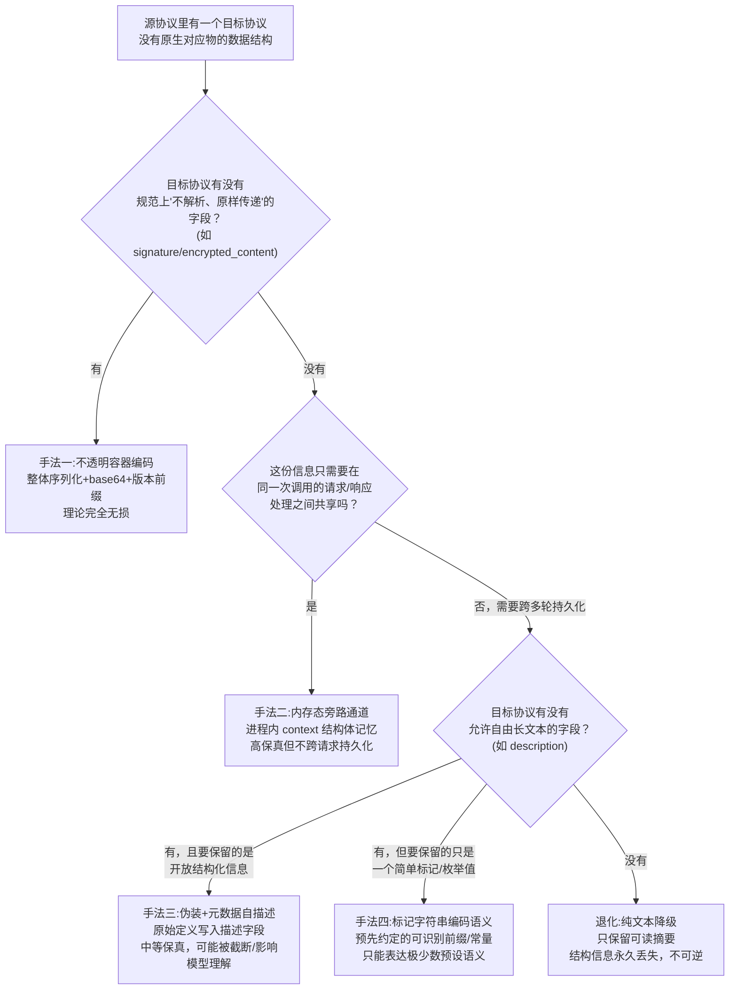

# 当协议无法原生容纳数据结构时：近似往返的四种手法

> 横向抽取自本系列前 5 篇文档（`01`~`05`）里已经出现过的具体代码案例，不引入新的调研对象，只做手法归类。
> 核心问题：当源协议的一个数据结构在目标协议里**没有对应字段**时，cc-switch 的转换层如何决定"要不要保留""怎么保留""保留到什么程度"？

## 总览：往返保真度不是二元的

前面几篇文档反复用到"无损"和"有损"两个词，但读完全部案例后会发现，中间还有一大片灰色地带——完全无损（编码后能一字不差还原）和完全有损（转成文本就再也回不去）之间，代码实际上踩出了好几种不同的**近似往返**策略,每种策略对应不同的成本和适用条件。这篇文档要做的事，是把这些散落在 5 篇文档里的具体案例抽出来，按"目标协议到底能提供什么样的容器"这个维度重新分类，看看到底有哪几种可复用的模式。

先给结论，后面逐类展开：

| 手法 | 核心思路 | 往返保真度 | 代表案例 |
|---|---|---|---|
| 手法一：不透明容器编码 | 把整个结构体系列化后塞进目标协议里"天生不透明"的字段 | 理论完全无损 | reasoning_bridge 的双通道 base64 编码 |
| 手法二：内存态旁路通道 | 不经过协议字段，用进程内的上下文对象记住原始信息 | 高保真但受限于同一进程/同一次请求链路 | CodexToolContext 记住工具原始类型 |
| 手法三：伪装成已知类型 + 元数据自描述 | 把目标协议不认识的类型伪装成它认识的类型，原始定义整体塞进一个允许自由文本的字段 | 中等保真，依赖描述字段不被截断/篡改 | custom_tool_call 伪装成 function，原始定义写入 description |
| 手法四：标记字符串编码语义 | 用一个人类可读的固定字符串本身承载一个布尔/枚举语义，不做通用编码 | 单一比特位的保真，只能表达预先约定好的极少数语义 | TOOL_RESULT_ERROR_MARKER 编码 is_error |
| （退化情形）纯文本降级 | 上述手法都用不上时，只保留可读文本，结构信息整体放弃 | 有损，不可逆 | thinking → reasoning_content 纯文本摘要 |

这四种手法不是互相排斥的可选项，而是**按目标协议能提供的"容器质量"从高到低排列的一个序列**——转换层写代码时的真实决策过程更接近于"先看有没有手法一的机会，没有就退到手法二，再没有就退到手法三，实在不行才接受手法四"，而不是随机选一种。理解这个序列，就能预判"如果未来要新增一个协议方向，某个字段该怎么处理"。

---

## 手法一：不透明容器编码——把整个结构体塞进"天生不透明"的字段

### 判断条件：目标协议里有没有一个字段，语义上就是"不保证任何格式，接收方原样存着就行"

Anthropic 协议里有两个这样的字段：`thinking.signature`（数字签名，接收方不需要解析它，只需要原样带回）和 `redacted_thinking.data`（加密数据，接收方明确知道自己看不懂）。OpenAI Responses 协议里对应的是 `reasoning.encrypted_content`。这三个字段有一个共同特征：**协议规范本身就告诉调用方"不要尝试解析这个字段的内容"**，这恰好给了转换层一个天然的藏东西的地方——只要接收方确实遵守"不解析"的约定，藏在里面的任意数据就是安全的。

### 代码案例：`reasoning_bridge.rs` 的双通道设计

详见 `03-anthropic-responses-bidirectional.md` §2.3。核心手法：

```rust
const OPENAI_REASONING_ITEM_PREFIX: &str = "ccswitch-openai-reasoning-v1:";
// 编码：serde_json::to_vec(整个 reasoning item) → base64(URL_SAFE_NO_PAD) → 加前缀
// 解码：去掉前缀 → base64 解码 → serde_json::from_slice 还原
```

反方向还有一套镜像实现（`transform_codex_anthropic.rs` 里的 `ANTHROPIC_THINKING_ENCRYPTED_PREFIX`），编码的是 Anthropic thinking block 整体，塞进 Responses reasoning item 的 `encrypted_content` 字段。

**为什么要加版本前缀**：`ccswitch-openai-reasoning-v1:` 这个前缀不是随便加的，它解决了一个关键问题——**解码方怎么知道这段不透明数据是不是自己编码的**。如果没有前缀，遇到一个真正由 Anthropic 服务端原生签发的 signature（不是 cc-switch 编码的），解码逻辑可能会尝试 base64 解码然后 JSON 解析，得到乱码或直接崩溃。加前缀之后，解码函数第一步就是检查前缀是否匹配，不匹配直接返回 `None`，安全地判定"这不是我编码的，不要动它"——这也解释了 `05-reasoning-thinking-tools-cross-protocol.md` §2 里提到的"无签名的原生 thinking block 会被静默丢弃"：不是丢弃逻辑写错了，而是这套编解码机制的设计前提就是"只认自己编码的数据，其余一律放弃"。

**这个手法的适用边界**：只在目标协议**恰好**提供这种不透明字段时才能用。如果目标协议根本没有"允许放任意不透明数据"的字段（比如 Chat Completions 协议里没有任何字段承担这个角色），手法一天然不可用，必须往下退。这正是为什么 `01-chat-to-responses.md` 和 `02-chat-to-anthropic.md` 里 Chat Completions 方向的 thinking 处理走不了这条路——不是实现偷懒，是协议本身没给这个机会。

**代价**：编码后的字符串对下游模型完全不可读（一段 base64），如果中途有任何环节尝试"理解"这个字段的内容（比如某个中间层做了字符串截断、大小写转换、或者试图从中提取信息），编码会被破坏，解码时会直接判定"前缀不匹配"而放弃还原，退化成信息丢失。所以这个手法要求转换链路上的**每一环**都严格遵守"这个字段我不解析、原样传递"的纪律，只要有一环违反，往返就断了。

---

## 手法二：内存态旁路通道——不经过协议字段，靠进程内状态记住信息

### 判断条件：请求和响应发生在同一次代理调用的生命周期内，且需要记住的信息只在这一次调用里有意义

如果某个信息**不需要**离开代理进程、也不需要跨越多轮对话持久化，那完全可以不占用任何协议字段——直接用一个内存里的结构体在请求处理和响应处理之间传递。这跟手法一的本质区别是：手法一编码的数据要跟着协议消息一起在网络上传输、可能被客户端存起来带到下一轮请求里；手法二的数据从头到尾不离开代理进程的内存。

### 代码案例：`CodexToolContext` 记住工具的"原始身份"

详见 `01-chat-to-responses.md` §2.4、§3.3。Responses 协议里的 `custom_tool_call`/`tool_search_call` 这两种工具类型在转成 Chat Completions 格式时，必须伪装成普通的 `function` 类型工具调用（因为 Chat Completions 只认 `type: "function"`）。伪装之后，"这个工具原来到底是 custom 还是 tool_search，还是本来就是普通 function"这个身份信息在协议字段里已经看不出来了——但代理进程在处理完请求之后马上要处理这次调用产生的响应，响应转换回 Responses 格式时又需要知道这个身份，才能正确地把它还原成 `custom_tool_call` 而不是错误地当成普通 `function_call`。

`CodexToolContext` 就是干这件事的：请求阶段扫描并注册所有工具的原始类型，存在这个结构体里；同一次调用的响应阶段，转换函数拿着同一个 context 实例查表，就能查到"这个工具名对应的原始类型是什么"。整个过程**不产生任何需要序列化到协议消息里的数据**，纯粹是请求处理函数和响应处理函数之间共享了一块内存。

**这个手法能做到"高保真"，但保真的范围有严格边界**：只在"这一次代理调用"的范围内有效。如果客户端把这次调用产生的工具调用结果存进对话历史，下一轮请求把历史带回来，`CodexToolContext` 早就随着上一次调用处理完毕被销毁了，没有任何记忆——这时候伪装成 function 的工具调用如果又被发回代理，代理只能凭工具名重新查一次"当前请求里注册的工具定义"来猜测类型，猜不中就会退化成普通 `function_call`（`01-chat-to-responses.md` §3.3 提到的"查不到就退化"）。

**跟手法一的分工关系**：手法一解决的是"跨越网络、跨越多轮对话"的持久化问题；手法二解决的是"同一次调用内部，多个处理阶段之间共享上下文"的问题。两者不冲突，很多场景下会配合使用——比如 reasoning 的 `id` 字段在 Chat Completions 方向就是靠不上手法一（协议没有不透明字段），也靠不上手法二（reasoning 的往返跨越了多轮对话，不是同一次调用内部的事），所以只能整体放弃（详见手法四下面的退化情形）。

---

## 手法三：伪装成已知类型 + 元数据自描述——把原始定义"写在描述里"

### 判断条件：目标协议只认识一个有限的类型集合，但允许某个字段（通常是 description/comment 类的自然语言字段）放任意长度的自由文本

当目标协议的类型系统比源协议贫乏、且手法二不适用（比如信息需要跨越多轮对话持久化，不能只活在内存里）时，一种变通做法是：**把源协议独有的类型伪装成目标协议认识的最接近的类型，同时把"这其实是什么"的元数据用人类可读的文本形式，写进目标协议里那些允许自由文本的字段**。

### 代码案例：custom tool 的原始定义写入 description

详见 `01-chat-to-responses.md` §2.4。Codex 的 `custom_tool_call`（自由格式输入，比如 `apply_patch` 直接吃一段 diff 文本而非结构化 JSON）转成 Chat Completions 的 function 工具定义时：

```
生成的 function 工具的 description 字段 = 
  "Original tool definition:\n```json\n<原始 custom tool 定义整体序列化>\n```"
```

这跟手法二里 `CodexToolContext` 的关键差异是：**这份信息真的被写进了协议消息本身**，会随着请求一起发给上游模型、也会被客户端存进对话历史、跨越多轮对话都带着走。之所以能这么做，是因为 Chat Completions 的工具定义里 `description` 字段的协议语义就是"给模型看的自然语言说明"，本身不限制格式和长度，恰好可以塞下一段 JSON 文本而不违反协议——这跟手法一里"塞进不透明字段"的思路相似，但**容器的性质不同**：手法一的容器是"协议规定不能解析"的字段，手法三的容器是"协议规定可以随便写、但语义上是给人/模型读的"字段。

**这个手法的保真度是"中等"而不是"高"**：因为 description 字段最终是要被**下游模型实际看到并可能参与理解**的，跟手法一"纯粹当作乱码搬运"完全不同。如果这段自动生成的 JSON 文本太长、或者跟模型自己生成的描述文本混在一起造成理解混乱，会真实影响模型的工具选择和调用质量——这是手法三独有的风险，手法一和手法二都不会遇到（因为它们的载荷从不会被模型真的读到）。另外，如果客户端或某个中间层对超长 description 做截断，元数据会被破坏，往返直接失效，没有前缀校验机制可以提前发现（不像手法一有版本前缀可以判断"这段是不是我编码的"）。

---

## 手法四：标记字符串编码语义——用可读文本代表一个预先约定的布尔/枚举值

### 判断条件：需要保留的不是任意结构化数据，只是一个极少数取值的语义标记（比如"这次调用是否出错"），且目标协议的这个位置只能放纯文本

手法一到手法三都是为了保留**任意的、开放的**结构化信息；但有些场景要保留的信息其实非常简单——只是一个二元或少量枚举的语义标记。这种情况下用不上前面那套"整体编码/整体反序列化"的重型机制，只需要约定一个固定的、不太可能跟正常内容冲突的字符串，出现这个字符串就代表一个特定语义。

### 代码案例：`TOOL_RESULT_ERROR_MARKER`

详见 `03-anthropic-responses-bidirectional.md` §2.5。Anthropic 的 `tool_result` block 有一个独立的布尔字段 `is_error`，但 Responses 协议的 `function_call_output.output` 在某些代码路径下被简化处理成纯文本数组，没有对应的错误标志位。转换层的处理是：

```rust
pub(crate) const TOOL_RESULT_ERROR_MARKER: &str = "[cc-switch:tool-result-error]";
// 编码方向：is_error == true 时，在 output 数组最前面插入一条 {"type":"input_text","text":TOOL_RESULT_ERROR_MARKER}
// 解码方向：看到 input_text 内容正好等于这个标记字符串，就把它转换回 is_error: true，并把这个标记自身从内容里去掉
```

这个手法跟手法一的本质区别：手法一编码的是**任意的、不知道内部结构的完整数据**（reasoning item 整体），解码方不需要理解内容只需要还原字节；手法四编码的是**一个已知的、极其有限的语义**（就是"是不是错误"这一个比特），解码方需要**认识**这个特定字符串才能识别出语义，如果这个字符串本身发生任何变化（哪怕只是加了个空格），识别就会失效。

**适用边界很窄**：只适合"取值范围极小、提前双方约定好"的场景。如果试图用这个手法编码一个开放的、任意的数据结构（比如想把整个 reasoning item 塞进一个标记字符串），会立刻发现根本不现实——标记字符串的本质是"预先约定的密码本"，不是通用编码器。

**风险**：如果模型自己生成的正常文本内容恰好跟标记字符串完全相同（概率极低但理论存在），会被错误地识别为错误标记。cc-switch 选择用一个带明显项目前缀（`[cc-switch:...]`）的字符串来最大程度降低这种碰撞概率，这也是这类手法的通用做法——标记字符串要足够"不像正常内容"。

同类的另一个例子是 `transform_gemini.rs` 里的 `SYNTHESIZED_ID_PREFIX`（`"gemini_synth_"`）：Gemini 的并行工具调用经常不带 `id` 字段，但 Anthropic 协议要求每个 `tool_use` block 必须有 `id`。转换层用 UUID 拼上这个前缀合成一个 id 暴露给 Anthropic 客户端，等下一轮客户端把工具调用结果带回来、需要转发给 Gemini 时，转换层检查 id 是否以这个前缀开头——如果是，就知道"这是我自己编的，Gemini 根本不认识，发回去之前必须先去掉"。这跟 `TOOL_RESULT_ERROR_MARKER` 是完全一样的思路：用一个可识别的前缀模式，给"目标协议不需要/不认识的合成信息"打上一个可以被自己识别的标签。

---

## 退化情形：纯文本降级——手法都用不上时，接受结构性丢失

当以上四种手法都不适用时（没有不透明字段可用、信息需要跨多轮持久化所以内存旁路不够、目标协议没有能自由写长文本的字段、要保留的信息本身就是开放结构而不是简单标记），转换层的选择是**坦然接受有损**，只保留一份人类可读的文本近似，明确放弃结构还原的可能性。

详见 `01-chat-to-responses.md` §2.3 和 `02-chat-to-anthropic.md` §3.5：Chat Completions 协议里的 `reasoning_content` 扩展字段就是这种退化的产物——它只是一个普通字符串字段，没有任何不透明容器的语义（模型和其他中间层都可能读到、处理、甚至截断它），所以只能塞纯文本摘要，`reasoning item` 原本的 `id`、`encrypted_content`、结构化的 summary part 类型全部在这一步永久丢失。响应方向再把这段文本转回 reasoning item 时，是**凭空重新构造**一个新 item（新分配 id，没有 encrypted_content），不是解码还原。

**这不是实现疏漏，是协议能力的天花板**：Chat Completions 协议设计之初就没有考虑过要承载结构化的、加密的思考过程数据，转换层不可能无中生有出一个不存在的容器。判断"该走哪种手法还是该接受退化"的关键提问始终是同一个：**目标协议在这个位置，到底提供了什么性质的容器？** 不透明字段 → 手法一；同请求生命周期内的内存共享 → 手法二；自由文本字段 → 手法三（结构化定义）或手法四（简单标记）；什么都没有 → 只能退化。

---

## 总结：一张决策流程图



这四种手法（加一种退化情形）不是 cc-switch 独创的理论框架，而是**从已经写好的、经过真实供应商流量验证的代码里逆向提炼出来的模式**。它们的共同前提都是"先看目标协议到底能提供什么容器，再决定用什么手法"——协议转换层的设计从不是"我想保留多少信息就编码多少"，而是"目标协议允许我藏多少，我就想办法用满这个额度，额度用尽了就诚实地承认丢失"。这也是贯穿整个协议转换层的核心工程哲学：**不对协议的能力边界做任何超出实际约束的假设，用足协议给的每一分自由度，同时对协议给不了的部分不做徒劳的挣扎**。
