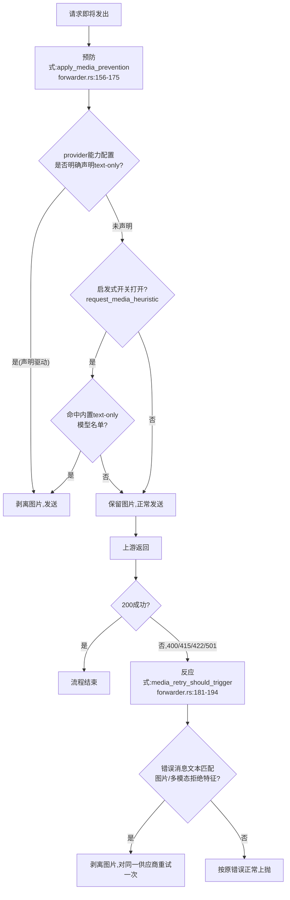

# 图片输入降级：media_sanitizer.rs 全貌

> 对应源码：`src-tauri/src/proxy/media_sanitizer.rs`（755 行，含约 500 行测试）
> 场景：Claude Code / Codex 客户端发出带图片的请求，路由到的模型/供应商不支持图片输入

## 总览：为什么图片输入需要单独一层兼容处理

Anthropic 和 OpenAI 的多模态模型越来越普及，但市面上仍有大量文本专用模型（DeepSeek-V4、GLM-5.2、LongCat-2.0 等）——它们的 API 端点会直接拒绝带图片 block 的请求。用户在 Claude Code 里粘贴一张截图，如果当前路由到的正好是个文本模型，请求会直接 400，对话流程中断。

`media_sanitizer.rs` 解决的正是这个问题：把请求体里的图片 block 换成一个纯文本占位标记 `[Unsupported Image]`，让对话能继续走下去（模型看不到图片内容，但至少不会因为协议不兼容而报错崩溃）。这是一个纯粹的"保证不报错"取舍——牺牲这一条消息里的视觉信息，换取整个对话流程不中断。

核心矛盾在于：**什么时候该做这个替换？** 替换早了（模型其实支持图片，却被误判成不支持）会无谓地丢失用户信息；替换晚了（等上游报错才处理）会浪费一次完整的请求往返，而且某些上游的错误消息千奇百怪,不一定能准确识别出"是图片问题"。所以这个模块设计了两条独立触发的路径,一条主动预防、一条被动兜底,搭配三层判定优先级来平衡"宁可信其能"和"宁可信其不能"这两种误判成本。

---

## 一、两条触发路径：预防式 vs 反应式



两条路径分别对应 `forwarder.rs` 里的两个函数：

- **预防式**：`apply_media_prevention`（forwarder.rs:156-175），发送请求**之前**调用，试图提前避免错误
- **反应式**：`media_retry_should_trigger`（forwarder.rs:181-194）+ 实际替换发生在 forwarder.rs:561 附近，收到上游错误**之后**判定是否该重试

这跟 `05-reasoning-thinking-tools-cross-protocol.md` 里 thinking_optimizer（预防）和 thinking_rectifier（补救）的分工思路是同一套模式——先看能不能提前预判避免错误，预判不到位再靠事后识别错误信息补救。

两条路径共用同一个总开关 `rectifier_config.enabled && rectifier_config.request_media_fallback`，但**预防式**额外受第三个开关 `request_media_heuristic` 管辖，**反应式**不受这个开关影响（forwarder.rs:179-180 注释明确写"这里是上游实测错误后的纯恢复，不是预测，故启发式开关与它无关"）——道理很直接：反应式重试的前提是上游已经**真实报错并明确拒绝了图片**，这已经是确凿事实,不存在"预测准不准"的问题,所以不需要用启发式开关去控制它。

---

## 二、预防式路径：三层判定优先级

`replace_images_for_text_only_model`（media_sanitizer.rs:18-40）的核心逻辑分三层，优先级从高到低：

### 第一层：请求体里根本没有图片，直接跳过（line 23-25）

```rust
if !contains_image_blocks(body) {
    return 0;
}
```
`contains_image_blocks`（line 42-44）同时检查 Anthropic/Chat 格式的 `messages[].content[]` 和 Responses 格式的 `input[]`，覆盖三种协议的图片 block 位置（详见 §四）。

### 第二层：查 provider 的显式能力声明——声明驱动，零误判（line 33-37）

```rust
if image_input_capability_from_settings(&provider.settings_config, model, allow_heuristic)
    != ImageInputCapability::Unsupported
{
    return 0;
}
```
这一步查的是 provider 配置里用户/系统显式写明的模型能力（`models[].input` 字段或 `modelCatalog.models[].modalities.input` 字段，来自 `model_capabilities.rs`）。**这一层的判定不受 `allow_heuristic` 参数影响**——测试 `explicit_text_capability_replaces_even_when_heuristic_disabled`（media_sanitizer.rs:730-754）验证了即使关掉启发式开关，显式声明的 text-only 能力依然会触发替换。反过来，显式声明支持图片的模型，即使命中了下面第三层的内置名单，也会被这一层的声明覆盖而保留图片——测试 `explicit_image_modalities_preserve_model_images`（line 460-482）验证了这一点。

**为什么显式声明享有最高优先级**：这是用户/系统主动配置的、有意图的信息，跟下面第三层"猜"出来的信息在可信度上完全不是一个量级，理应无条件优先。

### 第三层：内置的"已确认 text-only"模型名单——启发式预测，受开关管辖

如果 provider 没有显式声明（返回 `ImageInputCapability::Unknown` 而非 `Unsupported`），且 `allow_heuristic == true`，才会去查一份内置的模型名单（`is_confirmed_text_only_model`，在 `model_capabilities.rs:68` 定义，调用链是 `image_input_capability_from_settings` → `resolve_image_input_capability` → `is_confirmed_text_only_model`）。命中就替换，不命中就保留图片。

这份名单目前包含（从测试用例反推）：`deepseek-v4-pro`/`deepseek-v4-flash`、`glm-5.2`（但排除 `glm-5.2v`——`v` 后缀代表视觉版）、`LongCat-2.0`/`LongCat-Flash-Chat`、`qwen3-coder` 系列、`mimo-v2.5-pro`（但排除不带 `-pro` 的多模态版 `mimo-v2.5`）、`MiniMax-M2.7-Highspeed`、`step-3.5-flash-2603`。这份名单**不包含**通用意义上"可能是文本模型"的模糊猜测，而是针对确认过的具体模型/版本做精确匹配，且刻意区分了同一模型家族里的文本版和多模态版（`glm-5.2` vs `glm-5.2v`，`mimo-v2.5-pro` vs `mimo-v2.5`）——测试 `known_mimo_pro_replaces_but_mimo_multimodal_preserves`（line 485-516）和 `glm_52_is_classified_text_only`（line 634-642）专门验证了这种精确区分不会误伤同名多模态变体。

**未知模型的默认策略是"保留图片"，不是"猜它不支持"**：测试 `keeps_images_when_model_capability_is_unknown`（line 287-304）和 `preserves_images_without_explicit_capability_even_for_unknown_models`（line 415-431）验证了这一点。这是一个刻意的保守选择——宁可让请求可能因为图片报错（走到反应式路径兜底），也不愿意对一个实际支持图片的未知模型误判成不支持而无声丢弃用户的图片。

### `allow_heuristic` 开关只管第三层，不管第二层——测试直接验证了这个边界

```
heuristic_disabled_keeps_images_for_listed_text_only_models（line 710-727）：
  关闭 heuristic，即使模型在内置名单里，也不替换——保留图片

explicit_text_capability_replaces_even_when_heuristic_disabled（line 730-754）：
  关闭 heuristic，但模型有显式声明，依然替换——不受影响
```

这两个测试合起来精确刻画了 `allow_heuristic` 参数的作用边界：它只削弱"猜"这一层，不影响"declare"这一层。

---

## 三、反应式路径：从错误消息里识别"这是图片问题"

`is_unsupported_image_error`（media_sanitizer.rs:50-113）负责判定一次上游错误是不是因为拒绝图片输入导致的。判定分两个阶段：

### 阶段一：状态码粗筛

```rust
if !matches!(*status, 400 | 415 | 422 | 501) {
    return false;
}
```
只在这四个状态码范围内继续判断，其余状态码（比如 401 认证失败、429 限流、500 服务端内部错误）直接排除——这些状态码语义上跟"内容格式不被接受"无关。

### 阶段二：错误消息文本匹配，两条独立规则

**规则 A：自证性短语，无需再要求提及 image/media（line 70-76）**

```rust
const TEXT_ONLY_SELF_EVIDENT_HINTS: &[&str] = &["only support text", "only supports text"];
```

这条规则是为了应对一类特殊情况——代码注释直接引用了真实案例（issue #5025）：火山方舟等国产网关的报错原文是 `"Model only support text input"`，全程不出现 `image` 这个词。测试 `detects_text_only_errors_without_image_mention`（line 619-631）用的就是这条真实错误消息。规则里同时列了带 `s` 和不带 `s`（`support`/`supports`）两种形式，注释解释是因为"国产网关的英文常缺三单 s"——这是一处很具体的、从真实生产错误里摸出来的兼容性修补,不是通用规则,而是精确针对某一类观察到的措辞习惯。

**规则 B：先确认提到图片/多模态相关词，再确认提到"不支持"相关词（line 78-112）**

```
mentions_image 检查：image / vision / multimodal / multi-modal / modality / modalities / media / attachment
UNSUPPORTED_HINTS 检查：unsupported / not supported / does not support / doesn't support /
                       do not support / don't support / text only / text-only /
                       invalid content type / invalid message content / unknown variant /
                       unknown content type / unrecognized content type /
                       cannot process / cannot handle / can't process / can't handle /
                       unable to process
```
两个词表都要匹配到才算命中（`mentions_image && 命中任一 UNSUPPORTED_HINTS`）。这种"双重确认"是为了避免误报——只匹配 `unsupported` 这一个词太宽泛，可能命中跟图片完全无关的错误（比如"unsupported model"）；必须同时出现图片/多模态相关的关键词才能确认这次拒绝确实针对的是图片输入。

这套规则也覆盖了一类比较微妙的错误——测试 `detects_chat_content_unknown_variant_image_url_errors`（line 697-707）验证的是形如 `"unknown variant image_url, expected text"` 这种反序列化层面的错误消息（上游后端用 Rust/Go 之类强类型语言实现，图片 block 的 JSON 结构不匹配预期的 enum variant，抛出的是一个技术性的反序列化错误而不是业务层面明确的"不支持图片"提示）——`unknown variant` 命中 UNSUPPORTED_HINTS，`image_url` 命中 mentions_image，两者同时出现，判定成功。这说明这套字符串匹配规则不只是针对"友好的错误提示"设计的，也覆盖了"底层技术错误碰巧暴露了图片相关字段名"这种情况。

---

## 四、实际替换逻辑：三种协议格式的统一处理

`replace_images_in_body`（media_sanitizer.rs:126-144）同时处理两种请求体结构：

```rust
fn replace_images_in_body(body: &mut Value) -> usize {
    let message_replacements = body.get_mut("messages")...   // Anthropic/Chat 格式
        .map(...).unwrap_or(0);
    message_replacements + body.get_mut("input")...           // Responses 格式
        .map(replace_images_in_responses_input).unwrap_or(0)
}
```

`is_image_block_type`（line 224-226）统一识别三种图片 block 类型名：
```rust
matches!(block_type, Some("image" | "image_url" | "input_image"))
```
分别对应 Anthropic（`image`）、Chat Completions（`image_url`）、Responses（`input_image`）三种协议各自的命名——这跟前面几篇文档反复出现的"同一语义在三种协议里叫不同名字"是完全一致的模式，`media_sanitizer.rs` 在这里选择了用一个统一函数识别所有变体，而不是为每种协议单独写一套替换逻辑。

**递归深度**：替换逻辑会递归进入 `tool_result`/`function_call_output` 这类嵌套 content 结构内部——测试 `replaces_nested_tool_result_image_blocks`（line 582-604）验证了工具调用结果里嵌套的图片 block 同样会被处理，不会因为图片藏在 tool_result 内部就被漏检。

**`cache_control` 迁移**：替换成文本标记时，如果原图片 block 上带有 `cache_control` 字段（Anthropic 的 prompt cache 断点标记），会把这个字段迁移到新生成的文本 block 上（`replace_image_block_with_text_marker`，line 228-237）。测试 `preserves_cache_control_when_replacing_image`（line 654-677）的注释直接点明原因：**"image block 可能承载 prompt cache 断点；替换成标记时必须把 cache_control 迁移到新的 text block，否则会断掉缓存命中"**——这是一个容易被忽略但影响实际成本的细节：如果不迁移，本来能命中 prompt cache 的历史消息会因为图片被换成文本而丢失缓存断点，导致后续请求重新计费这部分 token。

**响应式路径 vs 预防式路径共用同一套替换函数**：`replace_image_blocks_with_marker`（line 46-48）是反应式路径调用的入口，内部直接调用跟预防式路径相同的 `replace_images_in_body`。两条触发路径的判定逻辑完全独立，但最终真正执行替换的代码是同一份，不存在两套实现可能产生不一致行为的风险。

---

## 五、和整流器/优化器体系的关系

这个模块的开关体系挂在跟 `05-reasoning-thinking-tools-cross-protocol.md` 提到的 `RectifierConfig` **同一个配置结构**下（`request_media_fallback`/`request_media_heuristic` 是 `RectifierConfig` 的字段，跟 `request_thinking_signature`/`request_thinking_budget` 平级）。这不是巧合——图片降级、thinking 签名整流、thinking 预算整流，在架构上被归为同一类"请求整流器"：都是"识别一种已知的兼容性问题模式，自动修正请求体，让请求能够成功"这个统一心智模型下的具体实例，只是各自识别的问题类型（图片拒绝 vs 签名冲突 vs 参数超范围）不同。

**与 thinking 整流器的关键差异**：thinking 整流器只有反应式（收到错误后才整流,参见 05 篇），图片整流是唯二同时具备预防式和反应式两条路径的模块（另一个是 thinking_optimizer,但那是无条件预防,不是"先猜再反应式兜底"的组合模式）。这个差异源于问题性质不同：thinking 签名冲突几乎无法提前预判（依赖运行时的路由结果和历史对话内容),但"这个模型是不是文本专用"是一个相对静态、可以靠模型名和配置提前推断的属性，值得投入一层预防机制去减少不必要的失败重试。
