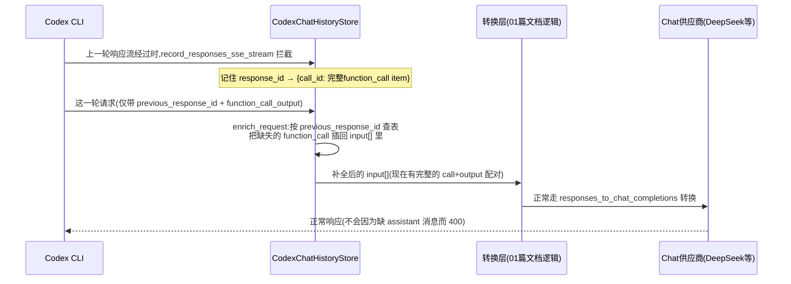
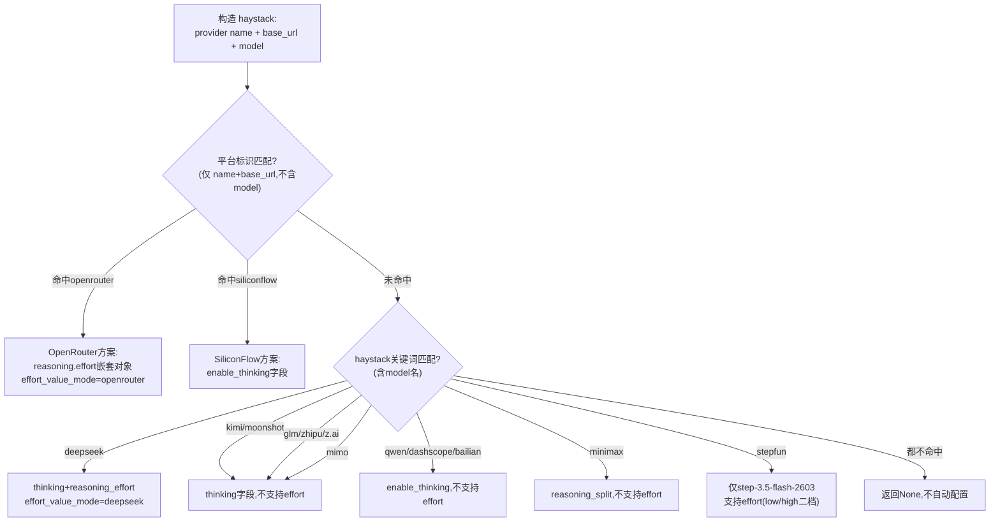

# Codex Chat 路由的两个隐藏依赖，以及一个未处理的缺口

> 对应源码：`codex_chat_history.rs`（863 行）+ `codex.rs` 里的 `resolve_codex_chat_reasoning_config`（line 312-335）/ `infer_codex_chat_reasoning_config`（line 336-453）/ `infer_aggregator_platform_config`（line 459-496）+ 全项目 web_search 相关代码
> 场景：三件事合并成一篇——两个让 Codex Chat 路由"看起来正常工作"的隐藏机制，加一个当前完全未处理的转换缺口

## 总览：为什么这三件事放在一起讲

前面几篇文档描述的是转换层"怎么把 A 协议转成 B 协议"，这篇讲的是三个更隐蔽的问题：两个**不转换字段本身、而是靠额外状态支撑转换结果能用**的机制（历史缓存、供应商自动识别），和一个**转换层完全没意识到需要特殊处理、直接当作普通数据处理**的缺口（web_search）。

前两个机制的共同点是：如果没有它们，`01-chat-to-responses.md` 描述的单轮转换逻辑在**多轮对话**或**接入新供应商**时会立刻失效或体验很差——它们不是转换逻辑的一部分，却是转换逻辑能在真实场景里跑得动的前提条件。第三个缺口则是一个到目前为止没有被任何整流器/优化器覆盖的真实空白,直接读代码验证过,不是猜测。

---

## 一、Codex Chat 历史缓存：为什么"上一轮工具调用"必须被记住

### 问题：Responses 客户端的续接协议，跟 Chat 供应商的强制要求互相冲突

Codex CLI 在多轮对话里续接请求时，通常只发送 `previous_response_id`（指向上一轮响应的 ID）加上这一轮新产生的内容（比如 `function_call_output`，工具执行完的结果）——**不会**把上一轮完整的对话历史重新发一遍，这是 Responses API 的设计理念："服务端记得上下文，客户端只需要说新发生了什么"。

但 `01-chat-to-responses.md` 描述的转换逻辑要把这个请求转成 Chat Completions 格式发给下游供应商，而 Chat Completions 协议没有"服务端记忆"这个概念——每次请求都要带上**完整的** `messages` 数组。如果这一轮请求体里只有一个孤零零的 `function_call_output`，转换后会变成一条**没有对应 `assistant` 消息（带 `tool_calls`）在前面**的 `tool` 角色消息——这在 Chat Completions 协议里是不合法的，DeepSeek 等供应商会直接拒绝（协议要求 `tool` 消息前面必须紧跟着发起这次调用的 `assistant` 消息）。

### 解决方案：一个有界的进程内缓存，记住上一轮的工具调用

`CodexChatHistoryStore`（codex_chat_history.rs:43-45）就是为了补这个洞。核心思路：**代理自己偷偷记住每一轮响应里产生的工具调用（`function_call`/`custom_tool_call`/`tool_search_call`），下一轮请求转换前，先把缺失的工具调用"补"回请求体里**，再送去做 `01` 篇文档描述的正常转换。



### 记录阶段：流式响应边过边"偷看"

`record_responses_sse_stream`（codex_chat_history.rs:367-390）包装在正常的响应流之上，**不修改流内容，只是顺手读一遍**：每解析出一个完整的 SSE block，就检查事件类型——

- `response.output_item.done`：单个工具调用 item 完成时立即记录（`record_call_item`，line 76-87），不用等整个响应结束
- `response.completed`：整个响应完成时,把 `response.output[]` 里的完整调用列表整体记录一遍（`record_response`，line 48-74）作为兜底

两种记录时机并存的原因：`output_item.done` 能更早拿到数据（流式过程中逐个产生），但如果因为某种原因漏掉了某个 item 的 done 事件，`response.completed` 的整体记录能兜底补全。

**只记录"调用类"item，不记录普通消息**：`is_call_item_type`（line 455-461）只认 `function_call`/`custom_tool_call`/`tool_search_call` 三种类型——纯文本消息、reasoning item 都不记录,因为下一轮请求缺的不是这些,而是 Chat 供应商强制要求的"调用配对完整性"。

### 恢复阶段：`enrich_request` 的三级查找

`enrich_request`（codex_chat_history.rs:89-194）在请求转换前调用，遍历 `input[]`：

1. **遇到调用类 item**（比如客户端自己带了个不完整的 `function_call`，缺 `name`/`arguments`）：用 `enrich_call_item_from_cache`（line 469-491）把缓存里对应字段（`name`/`namespace`/`arguments`/`input`/`status`/`execution`/`reasoning_content`/`reasoning`）**只填补缺失的字段**，已有的字段不覆盖
2. **遇到输出类 item**（`function_call_output` 等）：先检查这个 call_id 有没有对应的调用 item 也在当前请求里——没有就说明是"孤儿输出"，从缓存里把整个调用 item 找回来插到输出前面
3. **`restore_group` 批量恢复**（line 319-343）：一次性把这一轮所有缺失的调用配对都找回来，按顺序插入，不是逐个单独处理

**双层查找优先级**（`CachedLookup::call`，line 312-317）：先查 `previous`（`previous_response_id` 精确指向的那一轮），查不到再查 `fallback`（`unique_fallback_calls`，line 261-289：在全部缓存历史里找这个 `call_id` 唯一对应的那次调用）。代码注释解释了为什么需要 fallback：**"Codex 的某些流程（比如 subagent）可能会省略或改写 `previous_response_id`"**——如果严格只信 `previous_response_id`，这些场景下缓存机制会直接失效。fallback 的代价是：如果同一个 `call_id` 在历史上出现在多次不同响应里（理论上不该发生，但 `unique_call`，line 291-308，做了防御——如果查到多个来源就返回 `None`，不猜哪个是对的），宁可放弃恢复也不做错误的猜测。

### 有界缓存：`MAX_CACHED_RESPONSES = 512`

（codex_chat_history.rs:10）用 `VecDeque` 维护插入顺序，超过上限就从最老的开始清理（`prune`，line 233-241），同时同步清理 `call_index` 里失效的引用（line 253-259）——这是一个纯内存态的有界 LRU 风格缓存，跟 `06-round-trip-approximation-patterns.md` 里"手法二：内存态旁路通道"是同一类设计，只是这里的生命周期跨越多轮请求（不是单次调用内），所以需要有界淘汰机制防止无限增长。

---

## 二、Reasoning 自动检测：为什么每个供应商都要"猜"一套参数方案

### 问题：`01` 篇文档讲的 `apply_reasoning_options` 需要一份配置才能工作，这份配置从哪来

`01-chat-to-responses.md` §2.8 描述过 `apply_reasoning_options` 怎么把 effort 值写进正确的字段——但那个函数需要一个 `CodexChatReasoningConfig` 参数（`supports_thinking`/`supports_effort`/`thinking_param`/`effort_param`/`effort_value_mode`），这份配置本身是从哪里来的？如果每接入一个新供应商都要用户手动填这五个字段才能让 reasoning 正常工作，体验会很差。

`resolve_codex_chat_reasoning_config`（codex.rs:312-325）的逻辑是：**先看 provider 有没有显式配置这份元数据（`provider.meta.codex_chat_reasoning`），没有就自动推断**（`infer_codex_chat_reasoning_config`，line 336-453）。

### 三层匹配优先级：平台 > 模型厂商 > 无匹配



**为什么平台判断必须严格排除 model 名，只看 name+base_url**（`infer_aggregator_platform_config`，line 459-496，代码注释原话）：

> 聚合 / 托管平台的 reasoning 接口由平台决定：同一个模型在不同平台参数可能完全不同（DeepSeek 官方用 `thinking:{type}`、SiliconFlow 用 `enable_thinking`、OpenRouter 用原生 `reasoning:{effort}` 对象）。仅以平台标识（name / base_url）判定，绝不掺入 model 名——model 名属于模型厂商，会把托管平台误判成模型官方接口。

具体体现在测试 `test_resolve_codex_chat_reasoning_siliconflow_platform_overrides_minimax`（codex.rs:1488）：模型是 MiniMax（如果按厂商规则该走 `reasoning_split` 字段），但因为是通过 SiliconFlow 平台接入的，实际生效的是 SiliconFlow 的 `enable_thinking` 方案——**平台规则覆盖模型厂商规则**，这是三层优先级里最容易出错也最重要的一条。

**具体的兼容性坑点**（都是从代码注释里能读到的真实案例）：
- OpenRouter 的 effort 枚举没有 `"max"` 档，发 `max` 会触发 `400 reasoning_effort: Invalid option`（openclaw#77350），所以 `effort_value_mode: "openrouter"` 会把 `max` 钳到 `xhigh`（对应 `05-reasoning-thinking-tools-cross-protocol.md` §6.1 讲过的 `map_reasoning_effort` 四套映射表之一）
- SiliconFlow 平台故意**不**发 `reasoning_effort`（`effort_param: "none"`），因为该平台是用 `thinking_budget` 控制深度的,发 effort 反而可能不被接受
- StepFun 家族里**只有** `step-3.5-flash-2603` 这一个具体版本支持 effort（`supports_effort: Some(model.contains("2603"))`，line 389），其余 step 模型统一不支持——这是"厂商规则"里少见的、连版本号都精确到位的判断

### 这份配置在整体架构里的位置

它是 `01` 篇文档 §2.8 提到的"`apply_reasoning_options` 往哪个字段写"这个问题的**上游答案来源**。`01` 篇讲的是"拿到配置之后怎么用"，这一节补的是"配置从哪来"——两者合起来才是 Codex Chat reasoning 处理的完整链路：`codex.rs` 自动识别供应商 → 生成 `CodexChatReasoningConfig` → `transform_codex_chat.rs::apply_reasoning_options` 消费这份配置写入正确字段。

---

## 三、Web Search 内置工具：一个确认存在的转换缺口

### 背景：Anthropic 的"服务端工具"跟普通 function tool 完全不是一回事

Claude Code 客户端发起的请求，`tools` 数组里可能有一项是 Anthropic 的**服务端托管工具**（server tool），形如：

```json
{"type": "web_search_20250305", "name": "web_search", "max_uses": 5}
```

这跟普通的用户自定义 function tool 有本质区别：普通 function tool 需要客户端自己实现调用逻辑，Anthropic 服务端只是"请求客户端去调用一下"；而 `web_search` 是 Anthropic **自己的服务端**执行搜索，返回结果时用的是专门的 content block 类型 `server_tool_use`/`web_search_tool_result`（不是标准的 `tool_use`/`tool_result`）。

### 请求方向：完全没有区分，无脑转成普通 function 定义

`transform.rs::anthropic_to_openai_with_reasoning_content`（line 203-223）和 `transform_responses.rs::anthropic_to_responses`（line 244-264）里，工具转换代码结构几乎一样：

```rust
// transform.rs:203-223（Anthropic → Chat 方向）
if let Some(tools) = body.get("tools").and_then(|t| t.as_array()) {
    let openai_tools: Vec<Value> = tools
        .iter()
        .filter(|t| t.get("type").and_then(|v| v.as_str()) != Some("BatchTool"))   // 唯一的过滤条件
        .map(|t| json!({
            "type": "function",
            "function": {
                "name": t.get("name").and_then(|n| n.as_str()).unwrap_or(""),
                "description": t.get("description"),
                "parameters": clean_schema(t.get("input_schema").cloned().unwrap_or(json!({})))
            }
        }))
        .collect();
```

**唯一被过滤的类型是 `BatchTool`**（跟 `02-chat-to-anthropic.md` §8.1 提到的是同一处过滤逻辑，但那是另一个完全不同的类型）。`web_search_20250305` 类型的工具会原样走进 `.map()`,被硬转成：

```json
{"type": "function", "function": {"name": "web_search", "description": null, "parameters": {}}}
```

这是一个格式合法但语义上完全错误的产物——上游 Chat/Responses 模型看到一个叫 `web_search` 的"函数工具"，可能会尝试调用它，但代理这一侧根本没有为这个工具实现任何真实的执行逻辑。在 `src-tauri/src/proxy/providers/`（协议转换代码所在目录）搜索 `server_tool_use`/`web_search_tool_result`/`is_server_tool`/`hosted_tool` 等关键词，**零命中**（`transform_codex_anthropic.rs:392` 处提到 web_search 的唯一一行是注释里举的例子,属于 Codex 方向的通用兜底逻辑,不是针对 web_search 的专门识别；`codex_config.rs` 里另有一套 web_search 逻辑，但那是配置层，不是协议转换层，详见下文"跟配置层的 web_search 处理是两件不同的事"一节）。

### 响应方向：同样无脑转成普通 tool_use

如果上游真的把这个"看起来像 function 的工具"当作普通函数调用并返回了结果，`transform.rs::openai_to_anthropic`（line 588-610）和 `transform_responses.rs::responses_to_anthropic`（line 771-822）会把它转换成标准的 `{"type": "tool_use", ...}` block 发回给 Claude Code。但 Claude Code 客户端原本期待的是 `server_tool_use` 类型的响应——收到类型不匹配的数据，具体会怎么表现（忽略、报错、还是当作普通工具调用处理）取决于客户端自己的容错逻辑，代理这一侧没有做任何针对性处理。

### 对比：Codex 方向反而是"处理过"的（虽然只是丢弃，不是真正支持）

`transform_codex_chat.rs` 里的 `add_response_tool`（line 216-233）在遇到 `type == "web_search"` 时会走 `_ => {}` 分支——**直接丢弃**，不会让这个工具进入后续的 chat_tools 列表。这跟 Claude Code 方向的"完全无处理、硬转成假 function"相比,至少避免了"发一个没有实现的假工具给上游"这个问题，代价是彻底丢弃了这个工具的存在（Codex 客户端如果依赖 web_search，在这条转换路径下拿不到任何替代方案）。

配套地,`transform_codex_anthropic.rs:389-392` 有一条注释明确记录了这个设计考虑：**"unsupported hosted tools (for example web_search) must drop tool_choice too"**——如果因为过滤掉了 web_search 导致 `tools` 数组整体变空，连带的 `tool_choice` 也必须一起丢弃（否则触发 Anthropic 的 `"tool_choice may only be specified while providing tools"` 400 错误）。但这个兜底只解决了"工具列表变空后的连带问题"，**不是**针对 web_search 本身的识别和转发。

### 跟配置层的 web_search 处理是两件不同的事

`codex_config.rs` 里有一套完全独立的逻辑（`set_codex_native_web_search_field`，附近还有黑名单 `CODEX_WEB_SEARCH_REJECT_HOSTS`/`CODEX_WEB_SEARCH_REJECT_MODEL_PREFIXES`），在**请求构造之前**修改 Codex CLI 的 `~/.codex/config.toml`，让 Codex CLI 自己不要往请求里注入 `web_search` 工具。这解决的是"Codex CLI 主动声明支持这个工具"的问题，跟"协议转换代码怎么处理请求体里已经存在的 web_search 工具定义"完全不是一回事——前者发生在配置层、请求构造前；后者发生在协议转换层、请求已经到达代理之后。对 Claude Code 场景来说，`codex_config.rs` 完全不适用（Claude Code 不读 `~/.codex/config.toml`），所以这个场景下**唯一起作用的就是协议转换层，而协议转换层目前是空白**。

### 这是一个真实缺口，不是设计选择

跟前面几篇文档里"某个字段刻意选择丢弃"（比如默认丢弃 thinking）不同,这里没有任何代码或注释表明"我们知道 web_search 需要特殊处理但选择不处理"——转换代码是**完全没有意识到**这类服务端工具需要跟普通 function tool 区别对待。如果要修复，理论方向是：请求方向识别出 `web_search_20250305`（及同类的 `computer_use`/`bash`/`text_editor`/`code_execution` 等 Anthropic 服务端工具类型）并整体过滤掉（类似 Codex 方向已经在做的丢弃策略,或者更好地是保留但转成客户端能理解的替代形式）；响应方向如果收到这类工具的调用结果，应该转换成 `server_tool_use`/`web_search_tool_result` 而不是普通 `tool_use`。这两处目前都不存在。
