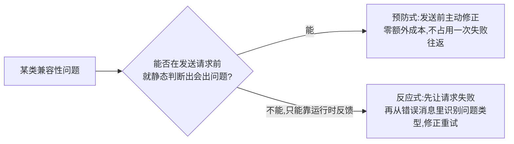
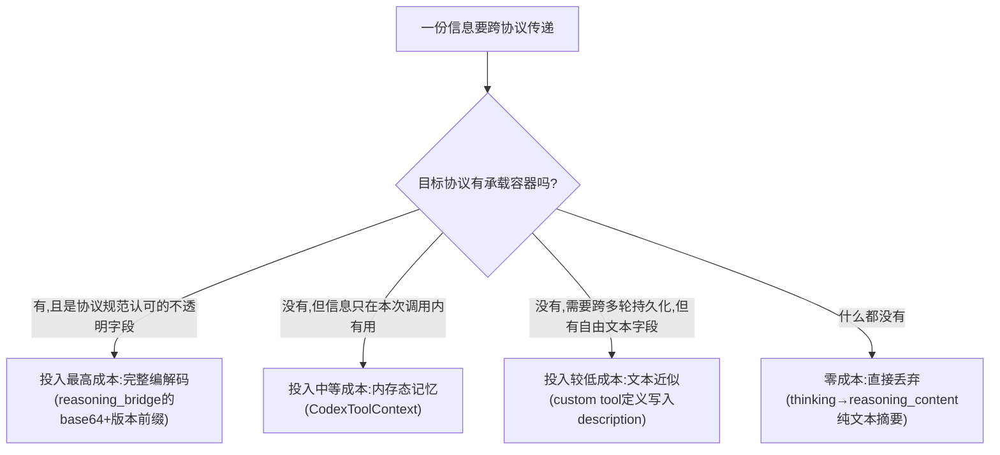

# cc-switch 协议转换层的设计模式、思想与权衡

> 横向综合前 8 篇文档（`01`~`08`）的架构层观察，不引入新的代码调研，聚焦于"为什么这套系统会长成这样"而不是"某个函数具体怎么写"。

## 总览：这不是一个协议网关，是一堵怪癖墙

读完 8 篇文档会发现一个反直觉的事实：cc-switch 的协议转换层里，**不存在任何统一的中间表示**。没有一个"通用消息类型"，没有一个"通用工具类型"，没有一个"通用 reasoning 类型"。`01`~`03` 篇讲的三对协议转换，字段映射表、effort 阈值、tool_choice 规则全部各写一份，字面上重复率很高。

这在教科书式的系统设计里通常是要重构掉的味道——"三处重复的逻辑应该抽出一个共享抽象"。但读到 `05` 篇的 reasoning effort 四套映射表（DeepSeek 只认 high/max 两档、OpenRouter 没有 max 档、SiliconFlow 完全不同的参数名）、`08` 篇的供应商自动检测（同一个模型在不同托管平台上参数完全不同），会发现这种重复不是疏漏，是**必要的自由度**。如果先设计一个"通用 Reasoning 强度"抽象，再让每个供应商适配这个抽象，你会立刻发现抽象本身就是错的——不存在一个能同时装下"budget_tokens 数值"和"effort 枚举"和"thinking 开关"的通用类型，任何抽象都会在某个供应商的怪癖面前碰壁。

所以第一个、也是最根本的设计选择是：**放弃抽象，直接对每一对（协议 A，协议 B，供应商 C）的组合写具体代码**。这不是没有设计，是一种反直觉但适应了问题本质的设计——协议转换领域的"通用解"往往比"逐一硬解"更脆弱，因为供应商的怪癖是无穷尽的、持续增长的，一个通用抽象每遇到一个新怪癖就要被迫扩展，扩几次就会散架；逐一硬解的代码不优雅，但每一块都独立、局部可修改，新增一个供应商怪癖只需要在对应的一处加一个分支，不会波及其他转换路径。

---

## 一、贯穿全局的第一原则：不报错优先于语义完整

如果要用一句话概括这整套系统的价值取向，是：**宁可丢失信息，不可让请求失败**。

这条原则不是写在某处的注释里，是从 8 篇文档里几十个具体决策反推出来的模式：

| 场景 | 语义完整的选择（没有做） | 实际的选择（不报错优先） |
|---|---|---|
| Chat Completions 收到 thinking block | 拒绝转换，报错告知用户"目标协议不支持" | 默认丢弃，一条消息只有 thinking 就整条消失（`02` 篇 §3.5） |
| 图片发到文本模型 | 报错让用户知道选错了模型 | 替换成 `[Unsupported Image]` 文字标记，静默继续（`07` 篇） |
| Anthropic thinking 签名冲突 | 报错让用户排查是路由问题还是供应商问题 | 整体删除 thinking block，重试（`05` 篇 §3） |
| web_search 工具遇到不支持的上游 | 报错说明这个工具不可用 | 伪装成假 function 定义硬发过去（`08` 篇 §3，唯一一处这条原则失效的场景，见下文） |
| Chat 供应商要求 tool 消息前必须有 assistant 消息 | 让不完整的请求按原样失败 | 用历史缓存主动补全缺失的调用（`08` 篇 §1） |

**为什么这是唯一合理的选择**：cc-switch 的产品定位是"让用户在不同供应商之间自由切换而不感知差异"。如果代理因为"这个供应商不支持这个字段"而拒绝转发，用户体验上跟"这个供应商本身坏了"没有区别——切换供应商的意义就消失了。所以"不报错"不是工程上的偷懒，是产品承诺的直接延伸：用户选择相信 cc-switch 能抹平协议差异，代理就必须尽最大努力兑现这个承诺，哪怕代价是某些信息（thinking 过程、图片内容）在切换后看不见了。

**这条原则的例外，恰恰暴露了系统的边界**：`08` 篇发现的 web_search 缺口，是这条原则在一个从未被显式考虑过的场景里"意外失效"的案例——不是代码故意选择报错，是代码根本没意识到这里需要一个决策。这提示了一个通用的判断方法：**审查一个协议转换系统是否完备，不要只看"已知的降级路径处理得多细"，要看"是否存在完全没被讨论过的输入类型"**——那些地方往往是真正的风险点，而不是已经被反复打磨的主路径。

---

## 二、二级原则：预防与补救的分工

在"不报错优先"这个总原则下面，还有一层更具体的架构模式，在三个完全不同的子系统里重复出现：

| 子系统 | 预防式实现 | 反应式实现 |
|---|---|---|
| Thinking 处理（`05` 篇） | `thinking_optimizer.rs`——Bedrock 环境已知需要 adaptive/budget 调整，发送前主动做 | `thinking_rectifier.rs` + `thinking_budget_rectifier.rs`——签名冲突和参数超范围无法提前预判,匹配错误消息后删除/修正重试 |
| 图片处理（`07` 篇） | `apply_media_prevention`——查 provider 显式声明或内置名单,提前替换 | `media_retry_should_trigger`——上游报错后,匹配错误消息文本,替换后重试一次 |
| web_search 处理（`08` 篇 vs 配置层） | `codex_config.rs` 里的黑名单——已知哪些网关拒收，Codex CLI 启动前写 TOML 屏蔽 | （协议转换层完全没有对应的反应式兜底，这正是缺口所在） |

**为什么这个二分法值得单独强调**：它把"未知但有限的兼容性问题空间"拆成了两个可以独立优化的子问题。预防式的价值是"零成本"——不占用一次失败的请求往返，不需要客户端多等一轮。反应式的价值是"能兜住无法提前预判的场景"——签名冲突取决于运行时的路由结果和历史对话内容，图片支持度取决于某个具体上游今天的行为，这些天然没法靠静态规则提前算出来。

**这个模式也解释了为什么 web_search 缺口会发生**：所有已经存在的预防/反应配对，都是先有了大量真实供应商报错案例（`05` 篇的七类签名错误匹配规则、`07` 篇的两条错误消息规则,都明确写着来自具体 issue 号），再倒推出预防式规则。web_search 目前只有配置层的预防（黑名单，针对已知拒收的供应商），协议转换层完全没有对应的反应式兜底——**因为还没有积累到足够多的真实报错案例去归纳出识别规则**。这暗示了一个规律：这套系统里几乎所有的兼容性代码都是"用真实生产事故喂出来的"，不是提前设计好的完备方案，代码里到处能看到"issue #xxx"的引用就是证据。这也意味着，任何新协议/新供应商刚接入的头几个月，大概率会先经历"报错→加反应式规则"的过程，再逐渐沉淀出预防式判断，这是这套架构本身决定的成长曲线,不是可以跳过的阶段。

---

## 三、往返保真度的分级决策：`06` 篇框架的架构意义

`06` 篇总结的四种手法（不透明容器编码、内存态旁路通道、伪装+自描述、标记字符串），表面上是"怎么编码一个字段"的技巧清单，往深一层看，它其实是这套系统对"信息值不值得保留"做资源分配的一套隐含算法：

**这套分级不是理论推导出来的，是从实现成本和风险两个维度反推的**：不透明容器编码需要维护版本前缀、编解码函数、往返一致性测试，工程投入最重，但换来的是"理论完全无损"；纯文本降级几乎零工程成本，但换来的是"结构信息永久丢失"。**投入的工程复杂度跟收益（往返保真度）成正比，这是一个理性的资源分配**——不是每一份信息都值得为它专门设计一套编解码机制，只有"协议恰好提供了合适容器"的信息才值得投入。反过来说，如果某份信息很重要但协议没给容器，投入再多工程努力也做不到无损（Chat Completions 的 thinking 就是这个情况，`02` 篇说得很清楚：这是协议能力的天花板，不是实现疏漏）。

**这个框架也解释了为什么会有"03 篇比 01/02 篇更重"这个现象**：`03` 篇（Anthropic↔Responses）能用上手法一（reasoning_bridge 无损编码），因为 Responses 协议恰好有 `encrypted_content` 这个不透明字段；`01`/`02` 篇（涉及 Chat Completions 方向）用不上，只能退化成手法四或直接丢弃。**协议转换的复杂度分布不是均匀的，取决于每一对协议各自提供了什么容器**——这不是代码写得认真与否的问题,是协议本身能力差异决定的先天不对称。

---

## 四、自造签名的架构性风险：唯一一处"自己给自己挖坑"的地方

前面几节讲的都是"系统怎么应对外部世界的复杂性"，这一节要单独指出一处**系统自己制造出来、又要自己收拾**的问题——这是整套架构里唯一一个跟其他兼容性问题性质不同的案例，值得单独拎出来讲。

`03` 篇和 `05` 篇合起来讲的故事是：reasoning_bridge 用 base64 编码把完整的 reasoning item 藏进 Anthropic thinking block 的 `signature` 字段，这个字段在协议规范里的语义是"Anthropic 服务端颁发的密码学签名，会被同一个服务端在后续请求里重新校验"。cc-switch 往这个字段里塞的是自己编码的任意数据，格式上合法，但内容上不是真正的密码学签名。

**第一次生成时没问题**（因为当时是代理自己在做编解码，不涉及真正的服务端签名校验）。但只要这个 thinking block 被发送给了**任何一个真正执行签名校验的 Anthropic 服务端**——不管是原本生成 encrypted_content 的那一个，还是故障转移后切换到的另一个——校验必然失败,因为这个"签名"从内容上根本就不是真实的密码学签名。`05` 篇的整流器（`thinking_rectifier.rs`）存在的唯一理由，就是补救这个自己制造的问题：把带假签名的 thinking block 整体删除，让请求降级成"没有历史负担"的新请求。

**为什么这跟其他兼容性问题不是一类**：图片不支持、schema 关键字不认识,这些都是"上游本来就不支持",是外部世界的客观限制；而签名冲突是"cc-switch 自己的无损编码方案在多供应商路由场景下的必然副作用"——只要还在用 reasoning_bridge 这套机制,只要还存在"服务商切换"这个功能,这类冲突就会持续发生,不是修复了某个 bug 就能根除的,是架构选择本身自带的代价。

**这处风险目前是靠"事后删除重试"兜底的,不是从架构上根除的**。可能的架构级改进方向（这里只是提出问题,不是给出确定答案）：能不能让编码后的签名带有可以被非始发服务端快速识别为"这不是真的签名，别校验"的标记？——但这需要 Anthropic 服务端本身配合识别（目前显然做不到，因为 Anthropic 不知道 cc-switch 这套私有编码约定）；或者故障转移路由时主动检测"这条历史消息里有没有 cc-switch 自己编码的假签名，有就提前清空再发",把补救逻辑从"收到 400 之后"提前到"发送之前"——这其实是把这个问题也纳入 §2 讲的预防/补救二分法里,只是目前它还停留在纯反应式阶段。这提示一个通用的架构审查方法：**任何"用协议里的不透明字段藏私有数据"的手法，都天然带有"这个字段本来的用途一旦被真正的服务端触发,就会产生冲突"的风险,这个风险的大小跟"这个字段在协议里原本承担的职责有多重"成正比**——`signature` 字段承担的是安全校验职责，这是这套编码方案里风险最高的一个应用点。

---

## 五、"逐供应商适配表"背后的认知模型：厂商识别本身就是一层协议

`08` 篇讲的 reasoning 自动检测（`resolve_codex_chat_reasoning_config`）值得单独拿出来看,因为它揭示了一个容易被忽略的事实：**"识别这是哪个供应商"这件事本身，也是一种需要被小心设计的协议转换**——只是转换的输入不是请求体字段，是 provider 的 name/base_url/model 三个字符串,输出不是转换后的 JSON,是一份决定后续怎么转换的配置。

这层"元转换"的设计跟前面几节的原则完全呼应：

- **平台优先于厂商**，是"不能假设一个简单抽象能覆盖所有情况"的又一次体现——同一个模型（MiniMax）在不同托管平台上参数完全不同，如果只按模型名判断会系统性出错，必须先看"这次请求实际会经过谁的推理框架"。
- **haystack 字符串拼接匹配**（`"{name} {base_url} {model}".contains(...)`）而不是精确的枚举匹配，是"不报错优先"原则在配置识别层面的体现——精确匹配意味着任何一个新的 base_url 变体、任何一个中转平台的模型名前缀,都可能匹配失败导致"识别不出供应商,退化成无配置"，模糊的字符串包含匹配牺牲了一点精确性,换来了更高的命中率。
- **`stepfun` 家族里精确到只有 `step-3.5-flash-2603` 这一个具体版本支持 effort**，是"具体胜过抽象"的极致案例——这类规则完全没法从任何通用逻辑里推导出来，只能是有人测试过这个具体版本之后手写下来的。

这层元转换的存在也再次印证了本文开头的判断：**这不是一个理论上优雅的协议网关，是一个持续吸收真实世界供应商信息、不断长出新分支的活系统**。厂商识别规则会随着新供应商接入而持续增长，这不是架构缺陷，是这类系统的正常生命周期。

---

## 总结：五条设计思想，一句话概括

1. **不报错优先于语义完整**——所有降级、丢弃、伪装的最终目的都是让请求走通，这是压倒一切的最高优先级。
2. **预防与补救分工**——能静态预判的问题提前修正（零成本），不能预判的靠运行时错误消息识别后补救（一次重试的成本），二者互补而非替代。
3. **往返保真度按容器可用性分级投入**——协议给了不透明字段就做无损编码，给了自由文本字段就做近似伪装，什么都没给就坦然丢弃，工程投入跟能达到的保真度成正比。
4. **自造的不透明数据存在天然的架构性风险**——凡是借用协议里"本来有安全/校验语义"的字段藏私有数据，这个字段一旦被真正的服务端触发校验就会冲突，这类风险不能靠加整流规则根除，只能靠减少触发面积缓解。
5. **供应商识别本身是一层需要持续演进的元协议**——没有一个通用规则能覆盖所有供应商的怪癖，识别逻辑会随着接入新供应商持续增长分支，这是常态而非临时状态。

一句话概括整套系统的设计哲学：**这不是一次性设计出来的协议网关，是一套被大量真实生产事故持续喂养、以"不让用户切换供应商时感知到失败"为唯一信条、放弃理论优雅换取局部可维护性的工程实现**。理解了这一点，再去看任何一处"看起来重复、看起来该抽象成通用逻辑"的代码，都能理解它为什么故意选择不抽象——因为下一个供应商的下一个怪癖，随时可能让任何提前设计好的抽象破功。
