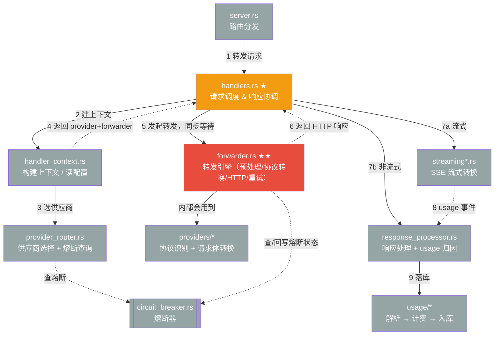

# cc-switch 代理模式核心模块架构图

## 抽象版（高层视角）

只保留 9 个核心模块。**核心是理解这是一条"调用并等待返回"的同步链路，不是画完箭头就各自结束的独立步骤**：`Handlers` 调 `Fwd` 之后会一直等着，等 `Fwd` 把 HTTP 响应交回来，`Handlers` 才能继续往下做 Streaming/RP。下图用实线箭头表示"发起调用"，虚线箭头表示"返回结果"，避免看起来像断头路。



**如何读这张图（按数字顺序走一遍）：**
1. `Server` 收到 HTTP 请求，路由匹配后交给 `Handlers`。
2. `Handlers` 先调 `Ctx` 构建本次请求的上下文（读 per-app 代理配置）。
3. `Ctx` 内部调 `Router` 选出可用供应商列表（`Router` 会查一次 `CB` 熔断状态，过滤掉已熔断的供应商）。
4. `Router` 选好的供应商和相关配置，随着 `Ctx` 的返回值一起交回给 `Handlers`（这一步很多人会漏看——`Ctx`/`Router` 不是走完就没了，结果是要回传的）。
5. `Handlers` 拿着供应商信息，调用 `Fwd`（`forward_with_retry`），**并同步阻塞等待它执行完**。
6. `Fwd` 在自己内部完成一整套动作后，把最终的 HTTP 响应（可能是流式的 body，也可能是完整 JSON）**返回给 `Handlers`**——这条虚线是全图最关键的一条，代表"转发引擎干完活了，把结果交还给调度者"，而不是 `Fwd` 自己处理完就结束。`Fwd` 干活期间会用到 `Adapters` 做协议识别/转换，也会去查/回写 `CB` 的熔断状态（失败重试、切换供应商都在这一步内部完成，抽象图不展开）。
7. `Handlers` 拿到响应后，自己判断是流式还是非流式：流式交给 `Streaming` 做 SSE 转换；非流式直接交给 `RP` 做响应处理。
8. 如果走的是流式路径，`Streaming` 在转换过程中会把 usage 相关的事件传回给 `RP`（两者不是并列无关的终点，`RP` 是两条路径的汇合点）。
9. `RP` 最终把 token 用量和费用写入 `Usage` 落库，一次请求结束。

**关键点：**
- 这不是一张"数据管道图"（数据从 A 流到 B 就不回头），而是一张"函数调用图"——大部分箭头都是"调用并等待返回"，所以逻辑上每一条实线最终都有一条对应的虚线返回边，只是很多返回边是"原路返回给调用者"，图上容易被忽略。
- `forwarder.rs` 内部还封装了多个整流/优化子步骤（模型映射、多模态净化、Copilot 优化、thinking 签名与预算整流、缓存注入等），全部包在第 5-6 步之间，抽象图统一归入 `Adapters` 这一格，详见下方详细版。
- `circuit_breaker.rs` 被 `Router`（选供应商时）和 `Fwd`（请求前查可用性、成功/失败后回写）两端共同依赖，是横向的状态存储，不属于纵向的调用链条。

---

## 详细版（模块级视角）

```mermaid
graph TB
    subgraph L1["第一层：路由分发"]
        Server["server.rs<br/>HTTP 服务器<br/>25 条路由 → 11 个 handler"]
    end

    subgraph L2["第二层：请求调度"]
        Handlers["handlers.rs<br/>请求调度中心<br/>响应协调者"]
    end

    subgraph L3["第三层：上下文 & 供应商选择"]
        Ctx["handler_context.rs<br/>构建请求上下文<br/>读取 per-app 代理配置"]
        Router["provider_router.rs<br/>供应商选择"]
        CB["circuit_breaker.rs<br/>熔断器"]
    end

    subgraph L4["第四层：转发引擎 ★ 核心"]
        Fwd["forwarder.rs ★<br/>转发引擎（4769 行）<br/>预处理 + 鉴权 + 重试"]
        MM["model_mapper.rs<br/>模型名映射"]
        MS["media_sanitizer.rs<br/>多模态净化"]
        CO["copilot_optimizer.rs<br/>Copilot 优化"]
        FS["failover_switch.rs<br/>运行时故障转移切换"]
        CI["cache_injector.rs<br/>缓存注入"]
    end

    subgraph L5["第五层：协议检测"]
        Adapters["providers/claude.rs<br/>providers/codex.rs<br/>providers/gemini.rs<br/>协议方向判断函数"]
    end

    subgraph L6["第六层：请求体协议转换 ~12,600 行"]
        T1["transform.rs<br/>Messages ↔ Chat"]
        T2["transform_responses.rs<br/>Messages ↔ Responses"]
        T3["transform_codex_anthropic.rs<br/>Codex Responses → Anthropic"]
        T4["transform_codex_chat.rs<br/>Codex Responses ↔ Chat"]
        T5["transform_gemini.rs<br/>Messages ↔ Gemini"]
    end

    subgraph L7["第七层：流式 SSE 转换 ~7,000 行"]
        S1["streaming.rs<br/>Chat SSE → Anthropic SSE"]
        S2["streaming_responses.rs<br/>Responses SSE → Anthropic SSE"]
        S3["streaming_codex_anthropic.rs<br/>Anthropic SSE → Responses SSE"]
        S4["streaming_codex_chat.rs<br/>Chat SSE → Responses SSE"]
        S5["streaming_gemini.rs<br/>Gemini SSE → Anthropic SSE"]
    end

    subgraph L8["第八层：reasoning / thinking"]
        RB["reasoning_bridge.rs<br/>Reasoning 跨协议保留"]
        TR["thinking_rectifier.rs<br/>签名整流"]
        TBR["thinking_budget_rectifier.rs<br/>预算整流"]
        TO["thinking_optimizer.rs<br/>Bedrock 预发送优化"]
    end

    subgraph L9["第九层：响应 & 用量统计"]
        RP["response_processor.rs<br/>响应处理 / usage 归因"]
        UP["usage/parser.rs<br/>Token 解析"]
        UC["usage/calculator.rs<br/>费用计算"]
        UL["usage/logger.rs<br/>用量日志入库"]
    end

    subgraph L10["基础设施"]
        HTTP["hyper_client.rs<br/>http_client.rs<br/>HTTP 传输层"]
        Auth["providers/auth.rs<br/>providers/copilot_auth.rs<br/>认证注入"]
    end

    %% ===================== 请求阶段（入站） =====================

    Server --> Handlers
    Handlers --> Ctx
    Ctx --> Router
    Router -- "选供应商时查熔断" --> CB
    Handlers --> Fwd

    %% Forwarder 内部预处理
    Fwd --> MM
    Fwd --> MS
    Fwd --> CO
    Fwd --> CI

    %% Forwarder: 熔断状态查询与汇报（请求前查可用性，成功/失败后回写）
    Fwd -- "请求前查可用 / 请求后回写结果" --> CB

    %% Forwarder: 协议判断（调用 adapter 函数）
    Fwd -- "1. 协议检测" --> Adapters

    %% Forwarder: 根据判断结果做请求体转换
    Fwd -- "2. 请求体转换" --> T1
    Fwd -- "2. 请求体转换" --> T2
    Fwd -- "2. 请求体转换" --> T3
    Fwd -- "2. 请求体转换" --> T4
    Fwd -- "2. 请求体转换" --> T5

    %% Forwarder: HTTP 转发 + 运行中故障转移
    Fwd --> HTTP
    Fwd --> FS
    Fwd -- "失败 → 整流 → 重试" --> TR
    Fwd -- "失败 → 整流 → 重试" --> TBR
    Fwd -- "预发送优化" --> TO

    %% ===================== 响应阶段（出站） =====================

    %% Handlers 收到响应后协调流式转换
    Handlers -- "流式: 选 streaming" --> S1
    Handlers -- "流式: 选 streaming" --> S2
    Handlers -- "流式: 选 streaming" --> S3
    Handlers -- "流式: 选 streaming" --> S4
    Handlers -- "流式: 选 streaming" --> S5

    %% Handlers 调 response_processor 处理最终响应
    Handlers --> RP
    Handlers -- "直接记账（部分转换路径）" --> UL

    %% reasoning 桥接（在转换层/流式层内部被调用）
    RB -.- T2
    RB -.- S2

    %% ===================== 用量统计 =====================

    RP --> UP
    UP --> UC
    UC --> UL

    %% ===================== 样式 =====================

    classDef core fill:#e74c3c,color:#fff
    classDef transform fill:#3498db,color:#fff
    classDef stream fill:#2ecc71,color:#fff
    classDef infra fill:#95a5a6,color:#fff
    classDef handler fill:#f39c12,color:#fff

    class Fwd core
    class Handlers handler
    class T1,T2,T3,T4,T5 transform
    class S1,S2,S3,S4,S5 stream
    class HTTP,Auth,CB,FS,Router,Ctx,MS,CO,MM,CI,UP,UC,UL,RB,TR,TBR,TO infra
```



**图例：**
- 🔴 红色 = 核心引擎
- 🔵 蓝色 = 协议转换
- 🟢 绿色 = 流式转换
- ⚪ 灰色 = 基础设施

**关键数据流（按一次请求的生命周期）：**

```
请求 → 路由匹配(server) → Handlers 调度
                              ├─ 构建上下文(Ctx) → 选供应商(Router，查熔断)
                              ├─ 转发(Fwd)：预处理 → 协议检测/转换 → 查熔断可用性 → HTTP → 失败重试(整流)
                              └─ 响应收尾：流式(Streaming) 或 非流式(RP) → usage 统计
```

## 修正说明（本次调研核对结果，含新发现的遗漏点）

以下是对照源码逐条核实"原 5 处修正说明"后的结论，以及本次额外发现、原文档未画出的调用关系。

| # | 问题 | 结论 | 说明 |
|---|------|------|------|
| 1 | `Router → CB → FS` 链式关系不准确 | ✅ 方向修正正确，但**不完整** | `Router → CB` 仅覆盖"选供应商时查熔断"；实际 `Fwd` 在请求前还会再查一次熔断可用性，请求成功/失败后也会回写熔断状态（`forwarder.rs` 通过 `provider_router` 调用 `allow_provider_request` / `record_result` / `release_permit_neutral`）。`CB` 是被 `Router` 和 `Fwd` **共同依赖的状态组件**，不是单向链路上的一环。`Fwd → FS`（运行时热切换在 forwarder 内触发）确认无误。 |
| 2 | `Adapters → Transform` 箭头方向有误 | ✅ 修正正确 | `Forwarder` 调用 adapter 函数做协议判断（`Fwd → Adapters`），再根据结果直接调 transform（`Fwd → Transform`），两者是独立的被调方，已在 `forwarder.rs` 逐一确认调用点。 |
| 3 | `Transform → Streaming` 连线错误 | ✅ 修正正确 | Streaming 系列文件（`streaming*.rs`）仅被 `handlers.rs` 调用，`forwarder.rs` 和各 `transform*.rs` 均无调用。`Handlers → Streaming` 成立。 |
| 4 | `S* → RP` 不准确 | ✅ 修正正确 | `Handlers` 同时调 `Streaming` 和 `RP`（usage 收集），但注意部分 Claude/Codex 转换路径下 `handlers.rs` 还有一条**直接调用 `usage/logger.rs` 记账**的旁路（`log_usage` 函数），不完全经过 `RP`。 |
| 5 | `failover_switch` 分组 | ✅ 修正正确 | 确认 `failover_switch.rs` 仅被 `forwarder.rs` 调用（4 处调用点），是转发引擎内部的运行时组件，而非 router 的一部分。 |

**新发现的遗漏（原文档两版均未画出）：**

- **路由数量有误**：原文档写"13 条路由注册"，实际是 **25 条路由、对应 11 个 handler 函数**（`server.rs:294-366`）。
- **`forwarder.rs` 内还有 3 个未入图的子模块**：`thinking_budget_rectifier.rs`（预算整流，独立于签名整流）、`thinking_optimizer.rs`（Bedrock 预发送优化）、`cache_injector.rs`（缓存注入）。三者均只被 `forwarder.rs` 调用。
- **`reasoning_bridge.rs`（RB）连线有误**：原文档画的是 `RB -.- T2` 和 `RB -.- T3`（连到 `transform_responses.rs` 和 `transform_codex_anthropic.rs`）。源码里 `T3`（`transform_codex_anthropic.rs`）完全没有导入 `reasoning_bridge`；实际第二个调用方是 `S2`（`streaming_responses.rs`），已在详细版图中改为 `RB -.- T2` / `RB -.- S2`。

## 完整请求数据流

```
1. 请求阶段（入站）
   Server → Handlers → Ctx → Router(查熔断) → Fwd
                                              ├─ MM / MS / CO / CI（预处理：模型映射/多模态净化/Copilot优化/缓存注入）
                                              ├─ 查熔断可用性（CB，请求前）
                                              ├─ Adapters（协议检测）
                                              ├─ Transform（请求体转换）
                                              ├─ HTTP（发出上游请求）
                                              ├─ TR / TBR（失败 → 签名/预算整流 → 重试）
                                              ├─ TO（预发送优化，无需失败触发）
                                              ├─ FS（成功切换供应商时，触发运行时热切换）
                                              └─ 回写熔断结果（CB，成功/失败/释放许可）

2. 响应阶段（出站）
   Handlers（接收上游响应）
       ├─ 流式 → Streaming（SSE 转换，内部部分路径调用 RB 保留 reasoning）
       └─ 非流 → 直接 JSON 解析
       └→ RP（usage 提取 + 模型名归因）／部分转换路径下 Handlers 直接调用 UL 记账

3. 用量统计
   RP → Parser → Calculator → Logger → 数据库
```
